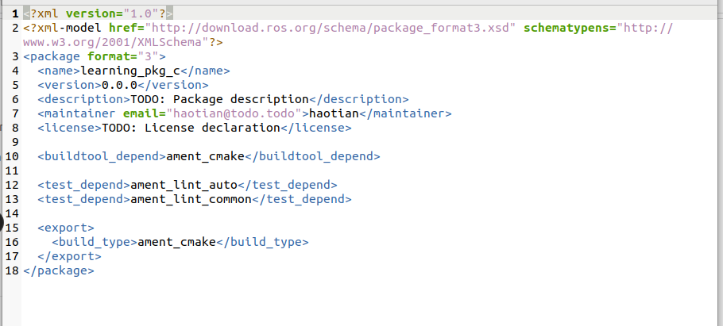
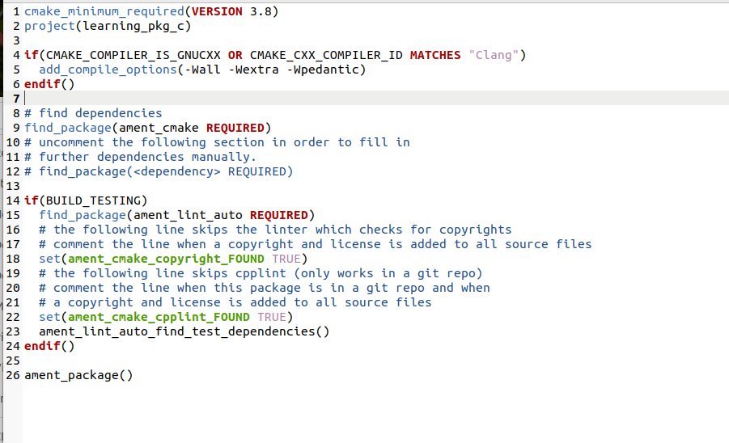
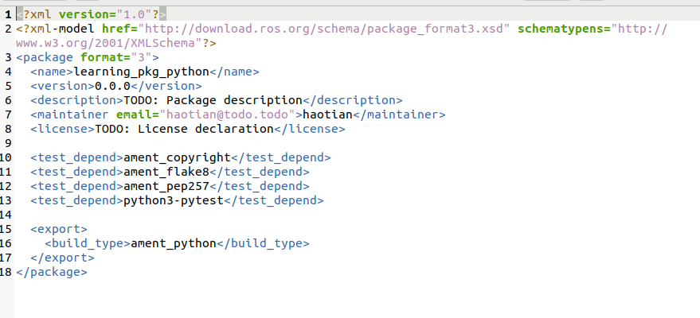
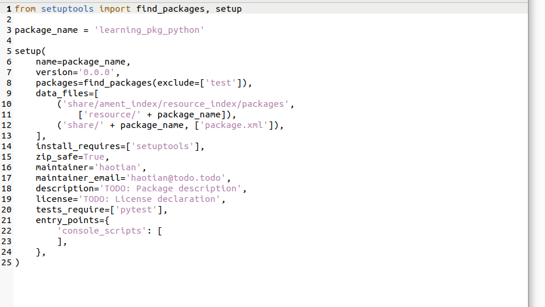
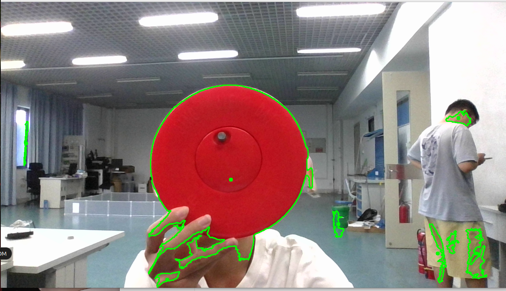

# 功能包

### 1.创建功能包

模板：

```text
ros2 pkg create --build-type <build-type> <package_name>
```

示例：

```纯文本
cd ~/dev_ws/src
ros2 pkg create --build-type ament_cmake learning_pkg_c               
ros2 pkg create --build-type ament_python learning_pkg_python

```

### 2.编译功能包

在创建好的功能包中，我们可以继续完成代码的编写，之后需要编译和配置环境变量，才能正常运行：

```纯文本
cd ~/dev_ws
colcon build   # 编译工作空间所有功能包
source install/local_setup.bash
```

### 3.功能包结构

#### c++：

C++类型存在两个文件：**package.xml**和**CMakerLists.txt**

package.xml文件的主要内容如下，包含功能包的版权描述，和各种依赖的声明。



CMakeLists.txt文件是编译规则，C++代码需要编译才能运行，所以必须要在该文件中设置如何编译，使用CMake语法。



#### python:

C++功能包需要将源码编译成可执行文件，但是Python语言是解析型的，不需要编译，所以会有一些不同，但也会有这两个文件：**package.xml**和[**setup.py**](http://setup.py "setup.py")

package.xml文件的主要内容和C++版本功能包一样，包含功能包的版权描述，和各种依赖的声明



setup.py文件里边也包含一些版权信息，除此之外，还有“entry\_points”配置的程序入口




