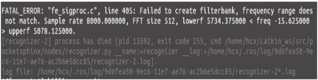

# 机器语言

1.pocketsphinx功能包

首先安装依赖的功能包和第三方库

```c++
 sudo apt-get install ros-kinetic-audio-common
 sudo apt-get install libasound2
 sudo apt-get install gstreamer0.10-*

```

接下来在以下四个网站分别下载四个deb依赖库的安装文件

```c++
https://packages.debian.org/jessie/libsphinxbase1
https://packages.debian.org/jessie/libpocketsphinx1
https://packages.ubuntu.com/xenial/libgstreamerplugins-base0.10-0
https://packages.debian.org/jessie/gstreamer0.10-pocketsphinx

```

使用如下命令依次安装下载完成的依赖库

```c++
sudo dpkg -i libsphinxbase1_0.8-6_amd64.deb
sudo dpkg -i libpocketsphinx1_0.8-5_amd64.deb
sudo dpkg -i libgstreamer-plugins-base0.10-0_0.10.36-2ubuntu0.1_amd64.deb
sudo dpkg -i gstreamer0.10-pocketsphinx_0.8-5_amd64.deb
```

依 赖 库 都 安 装 完 成 后 ， 使 用 如 下 命 令 从 GitHub 上 下 载pocketsphinx功能包的源码：

```c++
git clone https://github.com/mikeferguson/pocketsphinx
```

如发生以下错误：



解决该错误的方法是重新链接语音引擎。从以下网站下载CMUSphinx语音引擎：

```c++
https://packages.debian.org/jessie/pocketsphinx-hmm-en-tidigits
```

下载完成后不需要安装，解压缩deb文件和其中的data数据包，拷贝其中的model文件到功能包中即可。

2.语音识别测试

运行pocketsphinx包中的测试程序：

```c++
roslaunch pocketsphinx robocup.launch

```

2.sound\_play功能包

使用以下命令安装audio-common和相关依赖库：

```c++
 sudo apt-get install ros-kinetic-audio-common
 sudo apt-get install libasound2
 sudo apt-get install mplayer

```

测试：

```c++
rosrun sound_play soundplay_node.py
rosrun sound_play say.py "Greetings Humans. Take me to your leader."

```

roslaunch pocketsphinx robocup.launch
