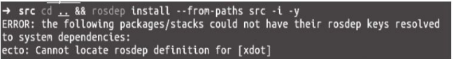

# 物体识别

#### 一、ORK功能包

1.安装依赖库

```c++
 sudo apt-get install meshlab
 sudo apt-get install libosmesa6-dev
 sudo apt-get install python-pyside.qtcore
 sudo apt-get install python-pyside.qtgui

```

2.新建个工作空间，使用wstool工具初始化

```c++
 mkdir ork_ws && cd ork_ws
 wstool init src https://raw.github.com/wgperception/object_recognition_core/master/doc/source/ork.rosinstall.kinetic.plus

```

3.下载所有需要的功能包源码

```c++
 cd src && wstool update -j8
 cd .. && rosdep install --from-paths src -i -y
```

下载过程中可能会出现如图所示的错误，这是由于缺少xdot功能包所导致的，需要在src文件夹中使用如下命令下载xdot功能包的源码，之后再重新下载ORK源码：



```c++
cd src && git clone https://github.com/jbohren/xdot.git
```

4.编译

```c++
cd .. && catkin_make
```

5.设置环境变量

```c++
 echo "export ~/ork_ws/devel/setup.bash" >> ~/.bashrc
 source ~/.bashrc
```

#### 二、物体识别步骤

1.创建需要识别的物体模型。

2.针对模型进行训练，生成识别模型。

3.使用训练后的识别模型实现物体识别。

#### 三、建立物体模型库

1.创建数据库，安装CouchCB工具

```c++
 sudo apt-get install couchdb
```

2.测试是否安装成功

```c++
curl -X GET http://localhost:5984
```

3.在数据库中创建一条可乐罐模型的数据

```c++
rosrun object_recognition_core object_add.py -n "coke " -d "A universal can of coke" --commit

```

4.在浏览器中打开以下网址

```c++
http://localhost:5984/_utils/database.html?object_recognition/_design/objects/_view/by_object_name

```

可以看到数据库中已经成功创建了一条数据，key值为coke，其他值都是数据库自动创建的。接下来就要具体描述物体的3D模型了。这里不需要自己创建模型，在ORK的教程中，已经包含了一个可乐罐的模型coke.stl，可以直
接 下 载 使 用 。

```c++
git clone https://github.com/wg-perception/ork_tutorials
```

将可乐罐模型加载到数据库中

```c++
rosrun object_recognition_core mesh_add.py 2fe3b16ee20729319a3fcb0c1400059c /home/haohao/ROS/ork_ws/src/ork_tutorials/data/coke.stl --commit
```

5.模型加载完成后，可以通过以下命令安装并运行一个couchapp工具进行查看：

```c++
 sudo pip install git+https://github.com/couchapp/couchapp.git
 rosrun object_recognition_core push.sh

```

6.浏览器打开以下网址

```c++
http://localhost:5984/or_web_ui/_design/viewer/index.html
```
