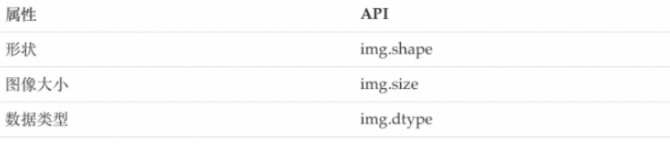

# OpenCV速成

### 一、图像的基础操作

#### 1、图像的IO操作

1.1.读取图像

```php
cv.imread()
```

读取方式的标志
cv.IMREAD*COLOR：以彩色模式加载图像，任何图像的透明度都将被忽略。这是默认参数。
cv.IMREAD*GRAYSCALE：以灰度模式加载图像
cv.IMREAD\_UNCHANGED：包括alpha通道的加载图像模式。
可以使用1、0或者-1来替代上面三个标志

```php
img = cv.imread('messi5.jpg',0)

```

1.2.显示图像

```php
cv.imshow()
```

注意：在调用显示图像的API后，要调用cv.waitKey()给图像绘制留下时间，否则窗口会出现无响应情况，并且图像无法显示出来。

```php
# opencv中显示
cv.imshow('image',img)
cv.waitKey(0)
# matplotlib中展示
plt.imshow(img[:,:,::-1])
```

1.3.保存

```php
cv.imwrite()
```

参数：1.文件名（保存位置）2.要保存的图像

```php
cv.imwrite('messigray.png',img)
```

#### 2、绘制几何图形

2.1.绘制直线

```php
cv.line(img,start,end,color,thickness)

```

-   img:要绘制直线的图像
-   Start,end: 直线的起点和终点
-   color: 线条的颜色
-   Thickness: 线条宽度

2.2.绘制圆形

```php
cv.circle(img,centerpoint, r, color, thickness)
```

-   img:要绘制圆形的图像
-   Centerpoint, r: 圆心和半径
-   color: 线条的颜色
-   Thickness: 线条宽度，为-1时生成闭合图案并填充颜色

2.3.绘制矩形

```php
cv.rectangle(img,leftupper,rightdown,color,thickness)
```

-   img:要绘制矩形的图像
-   Leftupper, rightdown: 矩形的左上角和右下角坐标
-   color: 线条的颜色
-   Thickness: 线条宽度

2.4.向图像中添加文字

```php
cv.putText(img,text,station,font,fontsize,color,thickness,cv.LINE_AA)
```

-   img:图像
-   text:要写入的文本数据
-   station:文本的放置位置
-   font:字体
-   fontsize:字体大小

**效果展示**

```python
import numpy as np
import cv2 as cv
import matplotlib.pyplot as plt
# 1 创建一个空白的图像
img = np.zeros((512,512,3), np.uint8)
# 2 绘制图形
cv.line(img,(0,0),(511,511),(255,0,0),5)
cv.rectangle(img,(384,0),(510,128),(0,255,0),3)
cv.circle(img,(447,63), 63, (0,0,255), -1)
font = cv.FONT_HERSHEY_SIMPLEX
cv.putText(img,'OpenCV',(10,500), font, 4,(255,255,255),2,cv.LINE_AA)
# 3 图像展示
plt.imshow(img[:,:,::-1])
plt.title('匹配结果'), plt.xticks([]), plt.yticks([])
plt.show()
```

#### 3、获取并修改图像中的像素点

我们可以通过行和列的[坐标值](https://www.zhihu.com/search?q=坐标值\&search_source=Entity\&hybrid_search_source=Entity\&hybrid_search_extra={"sourceType":"answer","sourceId":2661810547} "坐标值")获取该像素点的像素值。对于BGR图像，它返回一个蓝，绿，红值的数组。对于[灰度图像](https://www.zhihu.com/search?q=灰度图像\&search_source=Entity\&hybrid_search_source=Entity\&hybrid_search_extra={"sourceType":"answer","sourceId":2661810547} "灰度图像")，仅返回相应的强度值。使用相同的方法对像素值进行修改。

```python
import numpy as np
import cv2 as cv
img = cv.imread('messi5.jpg')
# 获取某个像素点的值
px = img[100,100]
# 仅获取蓝色通道的强度值
blue = img[100,100,0]
# 修改某个位置的像素值
img[100,100] = [255,255,255]
```

#### 4、获取图像的属性

图像属性包括行数，列数和通道数，图像数据类型，像素数等。



#### 5、图像通道的拆分与合并

有时需要在B，G，R通道图像上单独工作。在这种情况下，需要将BGR图像分割为单个通道。或者在其他情况下，可能需要将这些单独的通道合并到BGR图像。你可以通过以下方式完成。

```python
# 通道拆分
b,g,r = cv.split(img)
# 通道合并
img = cv.merge((b,g,r))

```

#### 6、色彩空间的改变

OpenCV中有150多种颜色空间转换方法。最广泛使用的转换方法有两种，BGR↔Gray和BGR↔HSV。

API：

```python
cv.cvtColor(input_image,flag)
```

参数：

-   input\_image: 进行颜色空间转换的图像
-   flag: 转换类型
    -   cv.COLOR\_BGR2GRAY : BGR↔Gray
    -   cv.COLOR\_BGR2HSV: BGR→HSV

### 二、算数操作

#### 1.图像的加法

你可以使用OpenCV的cv.add()函数把两幅图像相加，或者可以简单地通过numpy操作添加两个图像，如res = img1 + img2。两个图像应该具有相同的大小和类型，或者第二个图像可以是标量值。

**注意：OpenCV加法和Numpy加法之间存在差异。OpenCV的加法是饱和操作，而Numpy添加是模运算。**

```python
>>> x = np.uint8([250])
>>> y = np.uint8([10])
>>> print( cv.add(x,y) ) # 250+10 = 260 => 255
[[255]]
>>> print( x+y )          # 250+10 = 260 % 256 = 4
[4]
```

所以尽量使用OpenCV中的函数

示例：

```python
import numpy as np
import cv2 as cv
import matplotlib.pyplot as plt


# 1 读取图像
img1 = cv.imread("view.jpg")
img2 = cv.imread("rain.jpg")
 
# 2 加法操作
img3 = cv.add(img1,img2) # cv中的加法
img4 = img1+img2 # 直接相加


# 3 图像显示
fig,axes=plt.subplots(nrows=1,ncols=2,figsize=(10,8),dpi=100)
axes[0].imshow(img3[:,:,::-1])
axes[0].set_title("cv中的加法")
axes[1].imshow(img4[:,:,::-1])
axes[1].set_title("直接相加")
plt.show()

```
