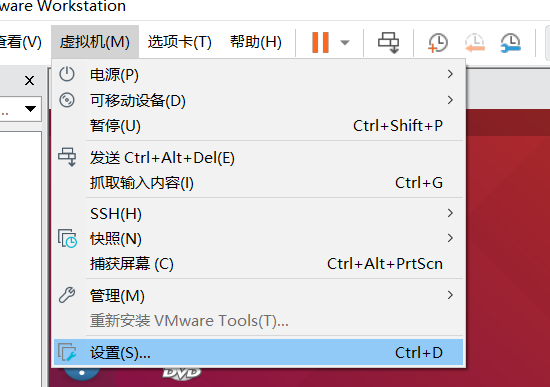
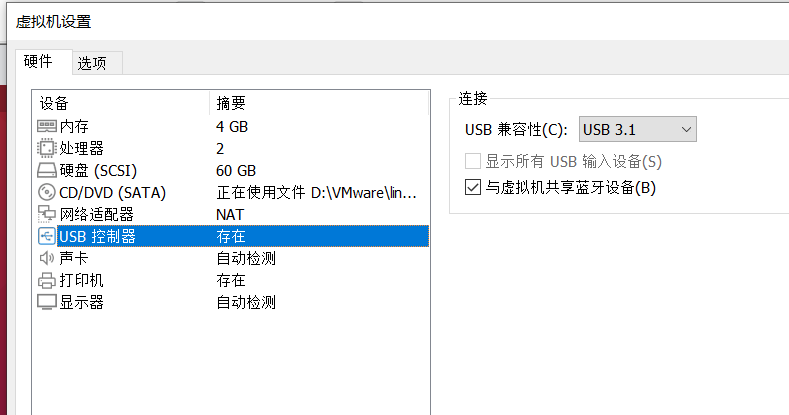
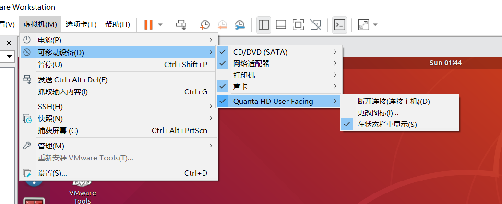

# ROS相机操作

#### 0.前置配置

1）将虚拟机的usb兼容性设置成3.1





2）安装cheese检查笔记本摄像头能否接入虚拟机

```c++
sudo apt install cheese
```

3）将笔记本的摄像头接入虚拟机



4）在terminal输入cheese检查虚拟机能否打开摄像头

```c++
cheese
```

#### 1.安装

```text
sudo apt-get install ros-<your-ros-version>-usb-cam

```

#### 2.启动

启动前将笔记本摄像头连接到虚拟机


```python
roslaunch usb_cam usb_cam-test.launch
```

查看发布的节点：

```纯文本
rostopic list
```

#### 3.处理图像数据

需要使用cv-brige

```纯文本
sudo apt-get install ros-<your-ros-version>-cv-bridge
```

尝试使用openCV自带的人脸识别模型

[haarcascade\_frontalface\_default.xml](file/haarcascade_frontalface_default_BIklSI5m7-.xml "haarcascade_frontalface_default.xml")

[haarcascade\_eye.xml](file/haarcascade_eye_LJsghtHKZP.xml "haarcascade_eye.xml")

编写节点：

```纯文本
#!/usr/bin/env python
import rospy
from sensor_msgs.msg import Image
from cv_bridge import CvBridge
import cv2

def face_recognition_callback(data):
    bridge = CvBridge()
    cv_image = bridge.imgmsg_to_cv2(data, "bgr8")

    face_cascade = cv2.CascadeClassifier() # 先实例化一个对象
    
    #模型路径改为自己的路径
    face_cascade.load('/home/gehaotian/ROS/rosdo/src/shibie/haarcascade_frontalface_default.xml') 
    eye_cascade = cv2.CascadeClassifier('/home/gehaotian/ROS/rosdo/src/shibie/haarcascade_eye.xml')

    faces = face_cascade.detectMultiScale(cv_image, scaleFactor=1.3, minNeighbors = 5)

    img1 = cv_image.copy()
    if len(faces) > 0:
        for x, y, w, h in faces:
            img2 = cv2.rectangle(img1, (x, y), (x + w, y + h), (0, 255, 0), 2)
            face_area = img2[y:y+h, x:x+w]
            eyes = eye_cascade.detectMultiScale(face_area, scaleFactor=1.3, minNeighbors=5)
            for ex, ey, ew, eh in eyes:
                cv2.rectangle(face_area, (ex, ey), (ex + ew, ey + eh), (0, 0, 255), 1)
    else:
        img2 = img1

    cv2.imshow("Face Recognition", img2)
    cv2.waitKey(1)

def face_recognition_node():
    rospy.init_node('face_recognition_node', anonymous=True)
    rospy.Subscriber("/usb_cam/image_raw", Image, face_recognition_callback)
    rospy.spin()

if __name__ == '__main__':
    try:
        face_recognition_node()
    except rospy.ROSInterruptException:
        pass
```

#### 4.附注：

1.创建工作空间并初始化

```纯文本
mkdir -p 自定义空间名称/src
cd 自定义空间名称
catkin_make

```

2.进入src创建ros包并添加依赖

```纯文本
cd src
catkin_create_pkg 自定义ROS包名 roscpp rospy std_msgs

```

3.进入ros包添加scripts目录并编辑python文件

```纯文本
cd ros包
mkdir scripts
cd scripts
touch name.py
```

4.编辑ros包下的Cmakelist.txt文件

```纯文本
catkin_install_python(PROGRAMS
   scripts/自定义文件名.py
  DESTINATION ${CATKIN_PACKAGE_BIN_DESTINATION}
)

```

5.进入工作空间目录并编译，然后source

```纯文本
cd 自定义空间名称
catkin_make
source /devel/setup.bash
```
