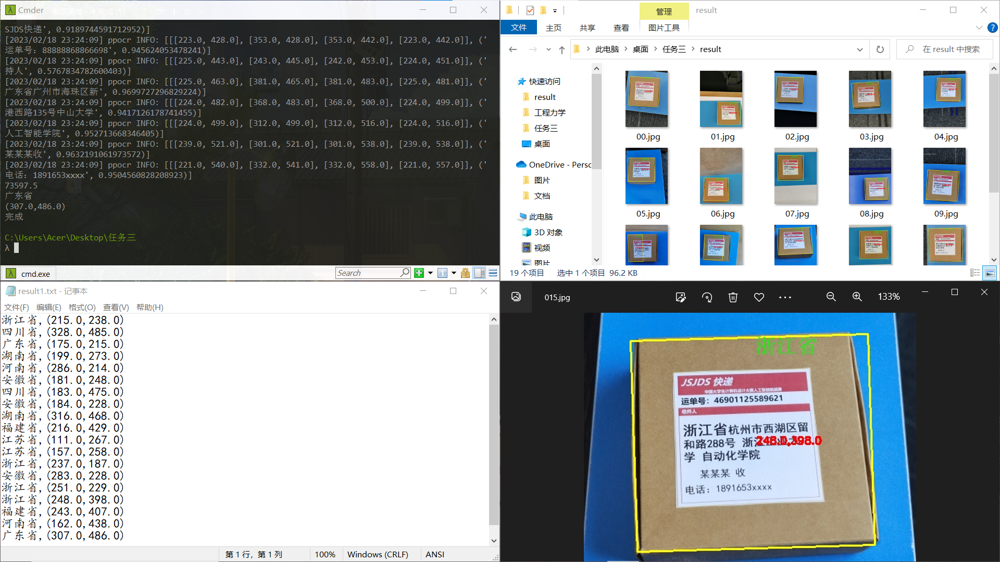
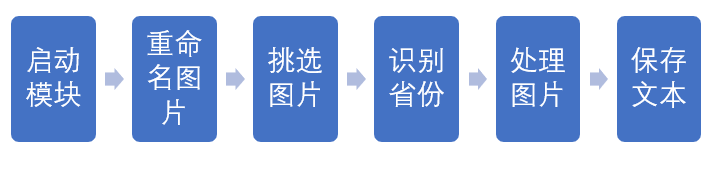

# 图像识别

### 目 录

第 1 章 作品概述.............................................................................................................................1

1.1 任务三概述.....................................................................................................................................................1
1.2 任务三创新点.................................................................................................................................................1
1.3 测试效果........................................................................................................................................................1
2.1 预选赛任务三：图像识别.............................................................................................................................2
2.1.1 任务问题 ...................................................................................................................................................2
2.1.2 一键启动 ..................................................................................................................................................2
2.1.3 文字识别 ...................................................................................................................................................2
2.1.4 图片处理 ...................................................................................................................................................2

第 2 章 技术方案.............................................................................................................................3

3.1 预选赛任务三：图像识别.............................................................................................................................3
3.1.1 一键启动 ..................................................................................................................................................3
3.1.2 文字识别 ..................................................................................................................................................4
3.1.3 图片处理 ..................................................................................................................................................4

第 3 章 已完成的任务.....................................................................................................................5

3.1 预选赛任务三：图像识别............................................................................................................................5
4.1.1 一键启动 ..................................................................................................................................................5
4.1.2 文字识别 ..................................................................................................................................................5
4.1.3 图片处理 ..................................................................................................................................................6

参考文献...........................................................................................................................................9

## **第1章 作品概述**

#### 1.1 任务三概述

本任务远程测试图像为20 张图片，并在 3 分钟内反馈识别结果。本任务使用 python 编程。通过PaddleOCR 模块进行文字识别，并且使用 Opencv 作图像处理，通过多种方法进行图像处理，最终可以快速在图片中找到快递盒位置并标注省份和中心点坐标信息。

#### 1.2 任务三创新点

集成化处理，一句运行程序语句即可实现功能，程序在windows下运行。

#### 1.3 测试效果

在项目目录下执行语句：

```python
python begin.py
```

可以看到会依次处理所有图片，处理后输出已被框出的图片和包含省份和坐标信息的文本文档。



#### 2.1 预选赛任务三：图像识别

#### 2.1.1 任务问题&#xA;

任务为远程测试 20 张随机的图片，并在 3 分钟内反馈识别结果。在此过程中需要框出图像中的快递单，并且在图像上标出快递单上的省份和中心点坐标，最后将识别到的信息保存到文本文件，并把处理好的图片输出到用于保存结果的文件夹中。

#### 2.1.2 一键启动

本部分需要编写用于从目标文件夹中随机挑选图片的 python 文件，将图片挑好后在另一文件夹中编号待用，编写脚本文件，一次性将 20 张图片处理好并输出结果。需要注意文件路径以及文件名称，将选出的图片在另一文件夹中重命名并保存。然后再进行图片处理操作

#### 2.1.3 文字识别

本部分需要使用 PaddleOCR模块进行文字识别，并将识别结果进行处理。首先需要先在电脑上成功安装、配置 PaddleOCR 环境。将目标图片进行识别并对文字信息进行处理，然后将提取所需邮件对应的省份信息传给图片处理的文件待用，最后将其输出到记录结果的文本文件中保存。

#### 2.1.4 图片处理

此处略，直接借用前人python文件

### 第2章 技术方案

#### 3.1 预选赛任务三：图像识别



#### 3.1.1 一键启动

在项目文件夹下运行代码：&#x20;

```python
python begin.py
```

#### 3.1.2 文字识别

使用paddleocr模块识别图片文字，筛选出省份

#### 3.1.3 图像处理

使用前人的图像处理代码进行图像框选与打印文字

### 第3章 已完成的任务

#### 3.1.1 一键启动

```python
import dopaddleocr
import os
import random
import cv_pic
import cv2

pic_path = r'./picture/'

def rename_pic():
    
    original_name = os.listdir(pic_path)
    for i in range(0,len(original_name)):
        geshi=original_name[i].split('.')
        geshi=geshi[-1]
        rname=f'0{i}.{geshi}'
        os.rename(os.path.join(path, original_name[i]), os.path.join(path, rname))

if __name__ == '__main__':

    # rename_pic()
    # a=random.randint(0,len(os.listdir(pic_path)))#随机取图片
    for i in range(0,len(os.listdir(pic_path))):#选取全部图片
        way=f'picture/0{i}.jpg'
        img_name=f"result/0{i}.jpg"
        # print(way)
        dopaddleocr.doorc(way)
        with open("./word.txt",'r',encoding='gbk') as f:
            shengfen=f.readline()
        img=cv2.imread(way,1)
        cv_pic.cuting_cut(img,shengfen,img_name)
```

#### 3.1.2 文字识别

使用paddleocr，识别后筛选

#### 3.1.3 图像处理

略

### 参考文献：

[飞桨PaddlePaddle-源于产业实践的开源深度学习平台](https://www.paddlepaddle.org.cn/ "飞桨PaddlePaddle-源于产业实践的开源深度学习平台")

2022060620-图像识别
