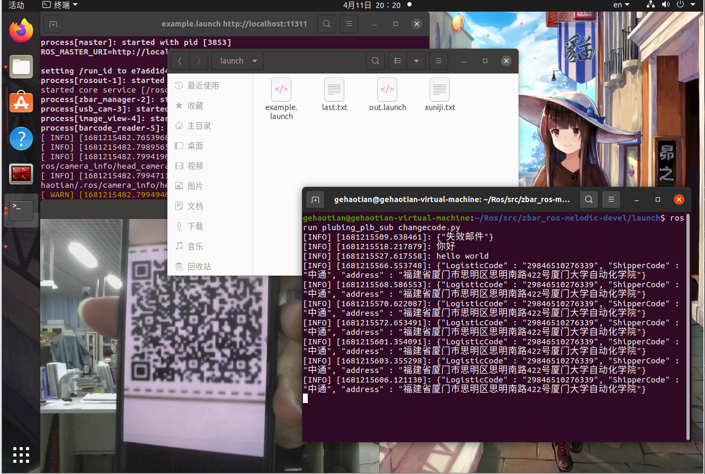
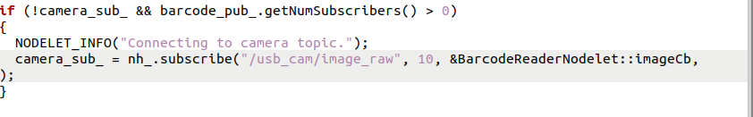

# 邮件省份识别

#### 1.二维码识别

1.1主要思想是使用ros中的zbar\_ros模块进行识别。



1.2配合模块编写launch文件：

```text
<?xml version="1.0"?>
<launch>
    <node pkg="nodelet" type="nodelet" name="zbar_manager"  args="manager"/>
    <!-- 启动zbar_manager-->
  <node name="usb_cam" pkg="usb_cam" type="usb_cam_node" output="screen" >
        <param name="video_device" value="/dev/video0" />
        <param name="image_width" value="640" />
        <param name="image_height" value="480" />
        <param name="pixel_format" value="yuyv" />
        <param name="camera_frame_id" value="usb_cam" />
        <param name="io_method" value="mmap"/>
    </node>
  <node name="image_view" pkg="image_view" type="image_view" respawn="false" output="screen">
    <remap from="image" to="/usb_cam/image_raw"/>
    <param name="autosize" value="true" />
  </node>
  <!-- 启动摄像头模块-->

    <node pkg="zbar_ros" type="barcode_reader_node" name="barcode_reader">
        <param name="throttle_repeated_barcodes" type="double" value="2.0"/>
    </node>
  <!-- 启动读取二维码模块-->
</launch>
```

1.3修改zbar模块中订阅的图像数据的话题名称：



1.4识别到二维码后订阅/barcode中的数据并处理：

新建一个节点订阅barcode信息并发布出失效邮件或者省份信息

```python
#! /usr/bin/env python
import rospy
import json
from io import StringIO
from std_msgs.msg import String

def doMSG(msg):
    rospy.loginfo("%s ",msg.data)
    
    if msg.data=='{"螟ｱ謨磯ぐ莉ｶ"}':#解析失效邮件可能会有乱码
      rospy.loginfo("失效邮件！！！")
    elif "失效"in msg.data:#解析失效邮件可能会有乱码
      rospy.loginfo("失效邮件！！！")
    else:
      a=StringIO(msg.data)#json解析数据
      j=json.load(a)
      if("省"in j['address']):#提取出省份信息
        shen=j['address'].find('省')
        rospy.loginfo("%s ",j['address'][0:shen+1])
    pub=rospy.Publisher("youjian",String,queue_size=10)#发布省份信息
    pub.publish(msg)

if __name__ == "__main__":
    rospy.init_node("changecode")
    sub=rospy.Subscriber("barcode",String,doMSG,queue_size=10)
    rospy.spin()
```
