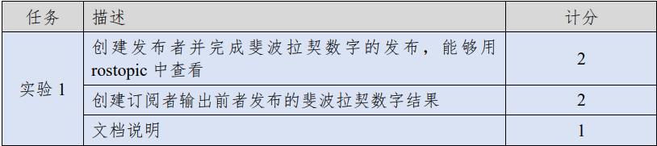
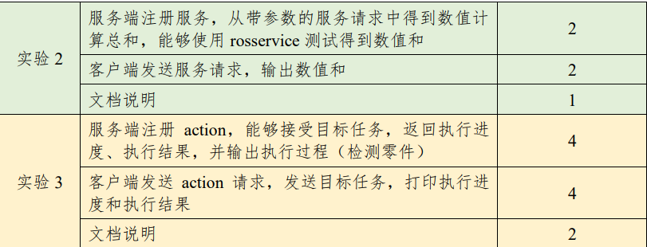
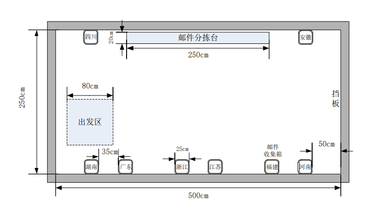
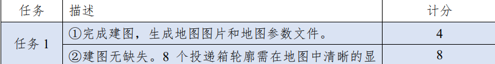
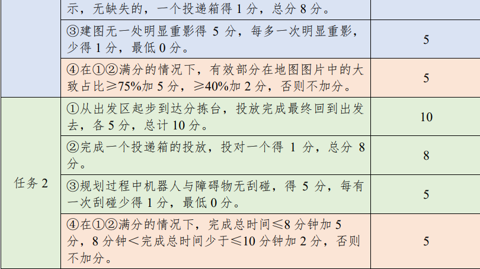
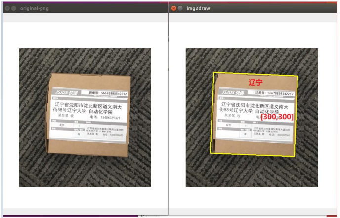
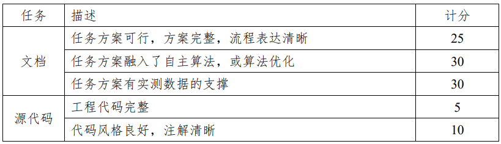
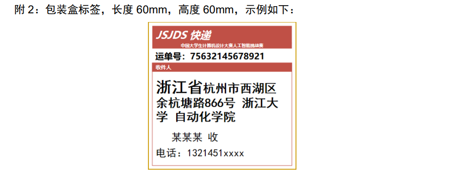
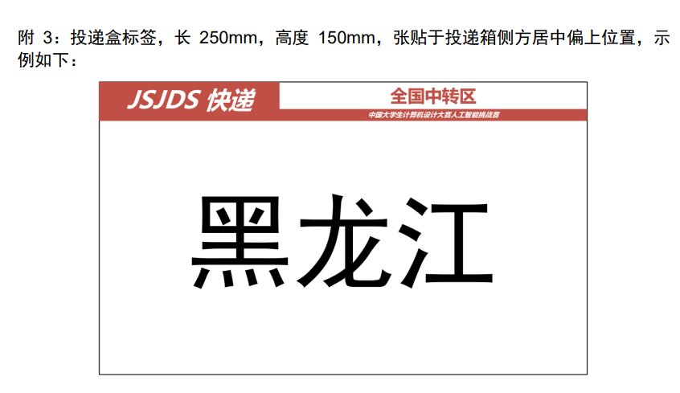

# 深大ROS俱乐部内部赛

**深大ROS俱乐部内部赛**

**一、第一部分，ROS 基础（20 分）**

完成 ROS 基础概念的编程实验，要求使用 C++或 python。

（一）完成 3 个关于 ROS 基础概念的编程实验。要求：展示代码与运行测试过程，并提供相关文档说明实现流程、运行步骤说明。

（**1）实验 1**：使用 ROS 话题(Topic)机制实现消息发布与订阅

要求：编写代码实现 ROS 中消息的发布与订阅：创建一个发布者，每隔 100ms 依次发送斐波

拉契数列的数字到话题/fibonacci 中；创建一个订阅者，订阅该话题，输出订阅结果。

如，订阅者依次输出： 1 1 2 3 5 8 …

**（2）实验 2**：使用 ROS 服务(Service)机制实现同步请求与答复

要求：编写代码实现 ROS 中的服务请求与答复：创建服务端，注册 Service，当服务端收到客

户端 Service 请求（携带整型参数 a,b）后，服务端返回 a,b 的和给客户端，客户端输出结果。

如，客户端给服务端 Service 发送参数 3, 9，服务端返回 12，客户端输出： 12。

**（3）实验 3**：使用 ROS 动作(Action)机制实现目标请求、进度与完成结

果的反馈。

要求：编写代码实现 ROS 中动作请求与进度反馈，创建服务端，注册 Action，客户端发送

action 请求检测 40 个零件， 服务端接收后，每隔 1s 检测一个零件（每检测一个打印一次）， 并

实时给客户端返回检测进度（客户端打印进度百分比），并在检测完毕时告知客户端目标完成。

如，服务端实时打印：检测 1 个零件 检测 2 个零件 ... 检测 40 个零件 检测完成

客户端实时打印： 2.5% 5% ... 100% 检测完成

**二、第二部分，机器人建图导航任务（40 分）**

**使用竞赛机器人（turtlebot3），在gazebo仿真环境中，完成基于 ROS 的机器人 SLAM 建图导航。**

（一）场地说明

选手自行搭建图示的一比一的场地，但是要求搭建的场地各部件尺寸与图纸尺寸差距在 5%以内。

补充说明：

1.场地中的邮件分拣台高度 15cm，邮件收集箱高度 15cm，挡板高度 15cm，误差小于 1cm

（二）要求：参赛选手控制竞赛机器人在指定场景中构建环境地图，并编写程序使得竞赛机器人能够在场景中完成自主导航。要求使用命令行运行建图和自主导航的程序或脚本，使用 rviz 工具来演示机器人的建图和导航过程，否则不得分。

**（1）任务 1**：选手操作机器人，在场景中构建出环境地图，并提供地图参数文件，描述地图的宽高、分辨率（地图像素与真实环境的比例）、世界坐标等参数。地图图片格式需为 png，pgm，jpg 等常见图片格式，方便评分员审查图片。 基础得分（4+8+5=17 分）由地图的精准程度决定， 精准程度主要由依据以下

两个方面：

1\) 地图是否完整。（8 个投递箱轮廓需在地图中清晰的显示，不能有明显缺失）

2\) 地图是否有重影。（平直的场地挡板、分拣台、投递箱不应生成多层重叠的图像）

额外加分（最高 5 分）由地图的构建效率决定，效率主要指：

1\) 地图有效部分(即场地图片)在地图图片中的大致占比。

**（2）任务2**：选手提前记录/计算好点位坐标，程序运行后，机器人从出发区出发，往返分拣台中间位置与投递箱进行邮件的抓取投放，每个投递箱均完成一次投放后，机器人返回出发区，请完成机器人在整个过程中的轨迹规划（不判别地区标识文字，不需要真实抓取与投放，即到达抓取与投放位置即可）。&#x20;

基础得分（10+8+5=23 分）由对点位的自主导航完成个数与安全程度决定，额外加分（最高 5 分）由完成时间决定。

（3）提交运行效果的全屏幕截屏视频。建图的地图图片不能人为手动编辑/裁剪，只能通过算法处理。路径规划在标记好出发位置和所有投递箱的坐标后，路径的规划过程不能人为干预。

（4）参赛队必须提交提供部署与运行流程文档，充分说明部署方式；提供理论总结。

（三）评分

1\. 计分

**三、第三部分，图像识别（40 分）**

（一）基础数据

图像内容为张贴在盒子上的标签。输出皆为各省区 2\~3 字的简写名称。

（二）要求：

（1）远程测试图像为随机的 20 张图片，并在规定时间（3 分钟）内反馈识别结果，识别结果格式如下图所示，否则识别失败。

要求用录屏文件+文本文件显示结果：录屏中依次显示原图像和带结果的图像（图像需显示长宽像素值）；文本文件中记录识别结果。

①输出邮件省份文字，显示到结果图像中。&#x20;

②在结果图像中标出邮件盒在图像中的位置（可如上图一样框起来），并得到邮件盒中心在图像中大致的像素坐标（图片左上角为 0，0，右为 x 正方向，下为 y正方向），显示在图像中。

③上述结果需以文本保存文件中，格式如下：

文件名：result.txt。内容为: 广东,(232,311); 江苏,(299,283);...

（没有计算坐标的，坐标统一写为(0,0)）

（2）同时提交运行效果的全屏幕截屏视频。

（3）参赛队必须提交可运行源代码，充分说明部署方式。

（三）评分

1\. 计分

（1）每一幅图片，识别省份正确的得 1 分，标出邮件盒坐标数据的得 1 分，总分 2分；

（2）记录整体运行时间。

2\. 排序

（1）以得分逆序为第一序；

（2）得分相同的，以正确率的逆序为第二序；

（3）正确率相同的，以运行时间的正序为第三序

四、文档要求

各参赛队必须提交说明文档与源代码。说明文档模板与相关要求另行公布。文档与源代码质量（含风格）皆作为评分要素。具体评分为：

五、综合排序

1\. 最终排名

最终预选赛成绩排名如下：

ROS 基础、建图、导航、图像识别、文档之排序，按照 5% : 20% : 30% : 30% : 15%之权重求和得到新的排序作为预选赛最终排名。若排名遇到相同的，从后往前逐步去掉一项权重再次排名。&#x20;

2\. 排名排除

以下情况将不进行排名，并淘汰：

（1）源代码无法运行，或运行效果与所提供视频明显不符；

（2）文档或源代码涉嫌抄袭、或具有知识产权争议；

（3）视频、文档、源代码等所有需要提交的内容，有一项或一项以上缺失；

（4）视频经过编辑，如中途剪辑、拼接、改变视频播放速度、故意截去屏幕部分区域等；

（5）机器人地图生成、自主导航或图像识别过程中有人为干预；

（6）网站填写内容与提交文档明显不符；

**附1：** 培训材料

[image.emf](file/image_yMCMTCSr0I.emf "image.emf")

**附件4：任务三录屏**

[\*\*<https://pan.baidu.com/s/1O3jm-fC1_EIlqIj7fUQV1Q?pwd=42v3> \*\*​](https://pan.baidu.com/s/1O3jm-fC1_EIlqIj7fUQV1Q?pwd=42v3 "https://pan.baidu.com/s/1O3jm-fC1_EIlqIj7fUQV1Q?pwd=42v3 ")

提取码:42v3

**附件5：图像识别**

[\*\*<https://pan.baidu.com/s/19_sxMpVnX1EQ3yeQ3aw1DA?pwd=97xt> \*\*​](https://pan.baidu.com/s/19_sxMpVnX1EQ3yeQ3aw1DA?pwd=97xt "https://pan.baidu.com/s/19_sxMpVnX1EQ3yeQ3aw1DA?pwd=97xt ")

提取码：97xt

**附件6：提交模板**

[image\_1.emf](file/image_1_W_nIhM8LyR.emf "image_1.emf")

**附件7：报名链接**

[**https://www.wjx.top/vm/OIQXI2u.aspx**](https://www.wjx.top/vm/OIQXI2u.aspx "https://www.wjx.top/vm/OIQXI2u.aspx")

**附件8：提交链接（打包成一个文件，以百度网盘的形式，注：有三个录屏）提交链接即可**

[**https://www.wjx.top/vm/tURrUF0.aspx**](https://www.wjx.top/vm/tURrUF0.aspx "https://www.wjx.top/vm/tURrUF0.aspx")

以上内容参考2022年第十五届中国大学生计算机大赛
