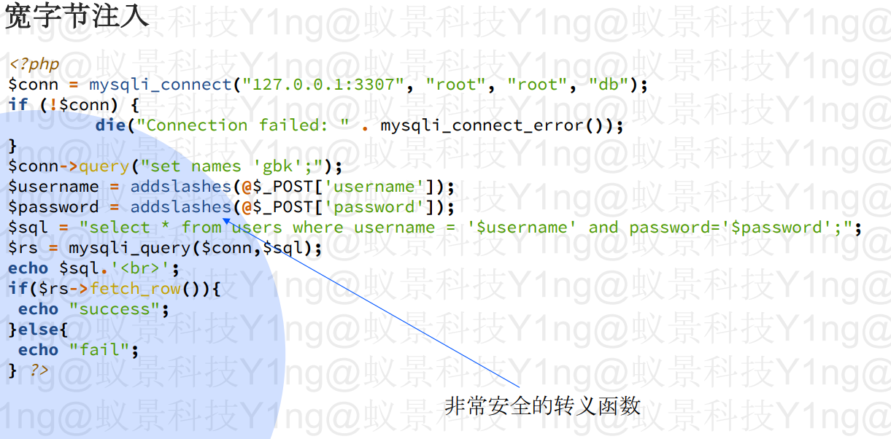
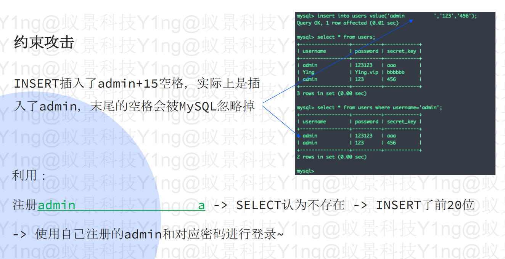

# MySQL宽字节、二次注入、约束攻击

### 宽字节注入:

宽字节注入主要是源于程序员设置数据库编码与PHP编码设置为不同的两个编码。

**重点语句：**

```sql
$conn->query("set names 'gbk';");
```



```sql
用户名输入：admin%df' or 1=1#
函数转义后为： admin%df\' or 1=1#
SET character_set_client ='gbk'后：admin運' or 1=1#
执行语句：... where username='admin運' or 1=1#'

```

**补充：**

Latin1编码：


### 约束攻击：

INSERT语句：截取前20个字符
SELECT语句：输入什么就是什么



### 二次注入：

攻击者构造的恶意payload首先会被服务器存储在数据库中，在之后取出数据库在进行SQL语句拼接时产生的SQL注入问题。

如：留言板修改，密码修改等。
