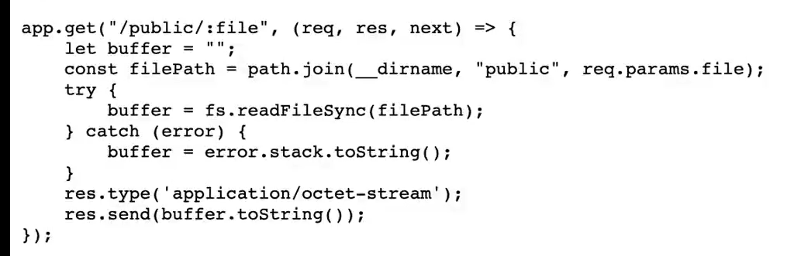

# NodeJS与python 的任意文件读取

### NodeJS任意文件读取：

#### 1.目录穿越：

```javascript
const path=require('path')
console.log(path.join(__dirname, file))
```

例：



直接请求/public/../app.js浏览器会去除../

使用curl —path-as-is example.com/public/../app.js 但其会将../解析成路由一部分

所以将../中/url编码，访问/public/..%2fapp.js

### python任意文件读取

#### 1.目录穿越

```javascript
os.path.join(‘/tmp’, file)
利用
os.path.join('/tmp', '../etc/flag');

```

当过滤了'./'时：

利用python特性直接从根目录开始写：

```javascript
os.path.join('/tmp', '/usr/local/app/app.js');
其会返回后一个根目录路径
```

### ReDos正则延时

略
