# PLC

#### 1.设备组态

控制器CPU：

IO扩展：

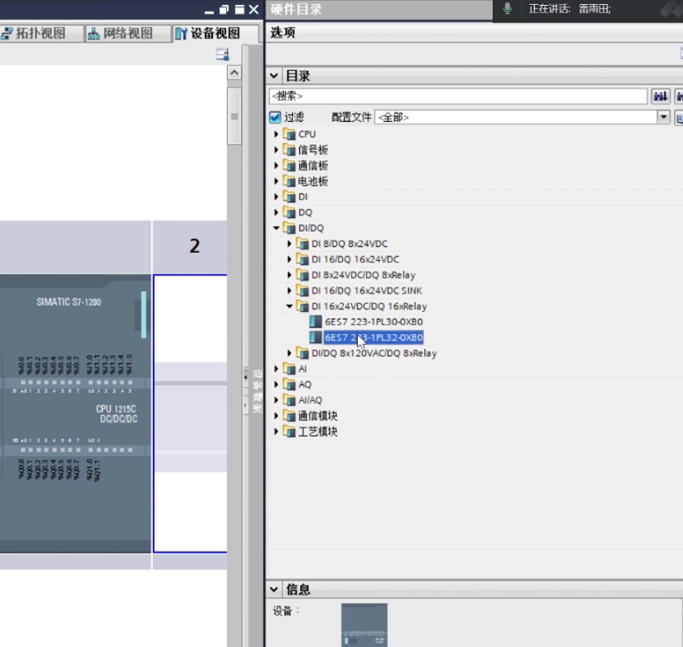

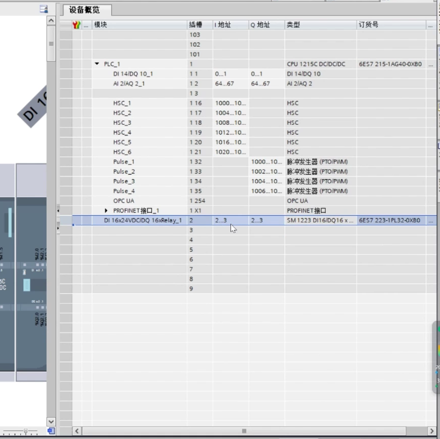

网络视图、硬件输入里面添加屏幕：

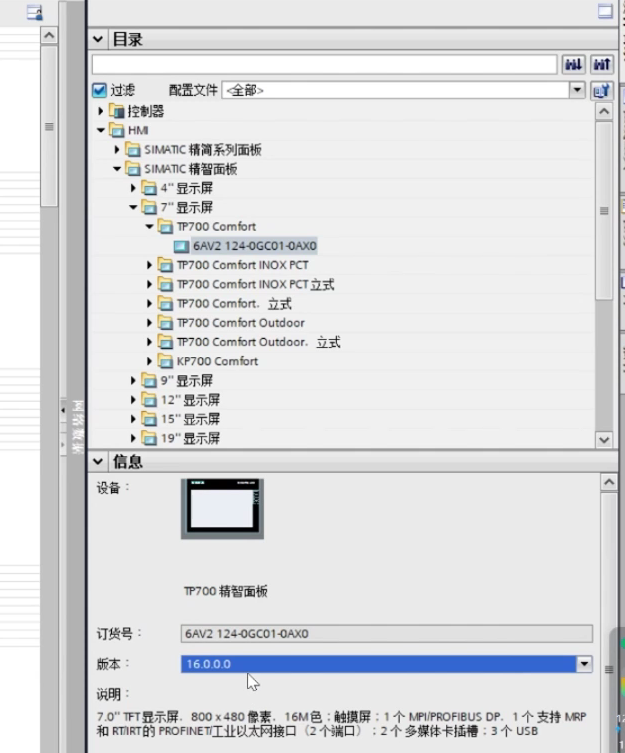

#### 2.相机通讯

添加通讯程序块：

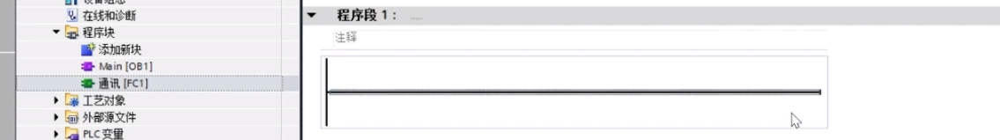

在通信开放式用户通信中：

添加之后组态

伙伴地址为相机地址，端口定为9730或现场查看

添加相机数据块

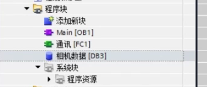

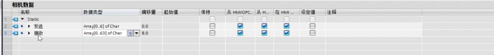

回到程序点击相机发送拖入data

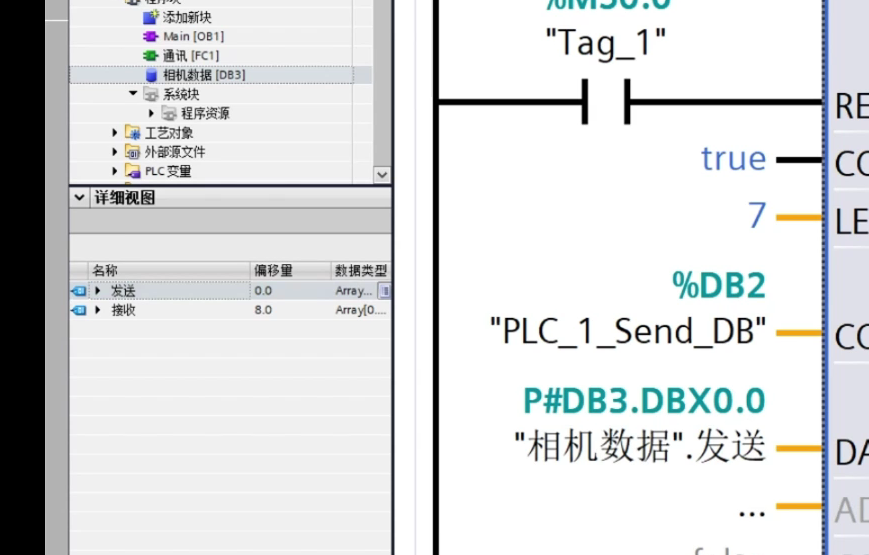

接收数据块：

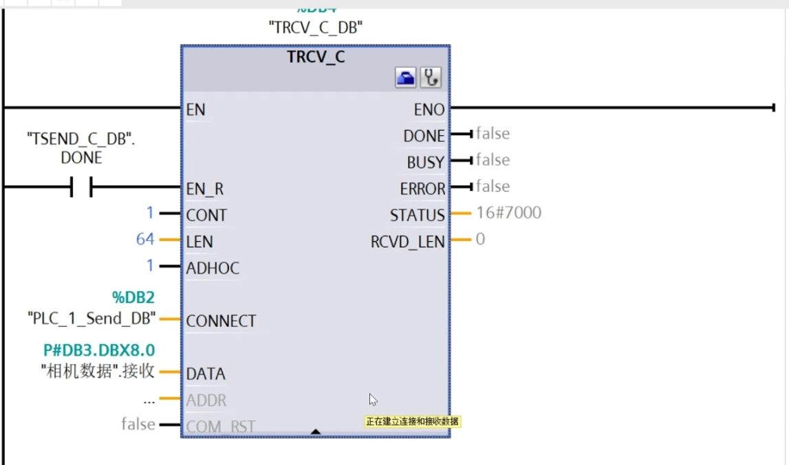

#### 3.机器人通讯

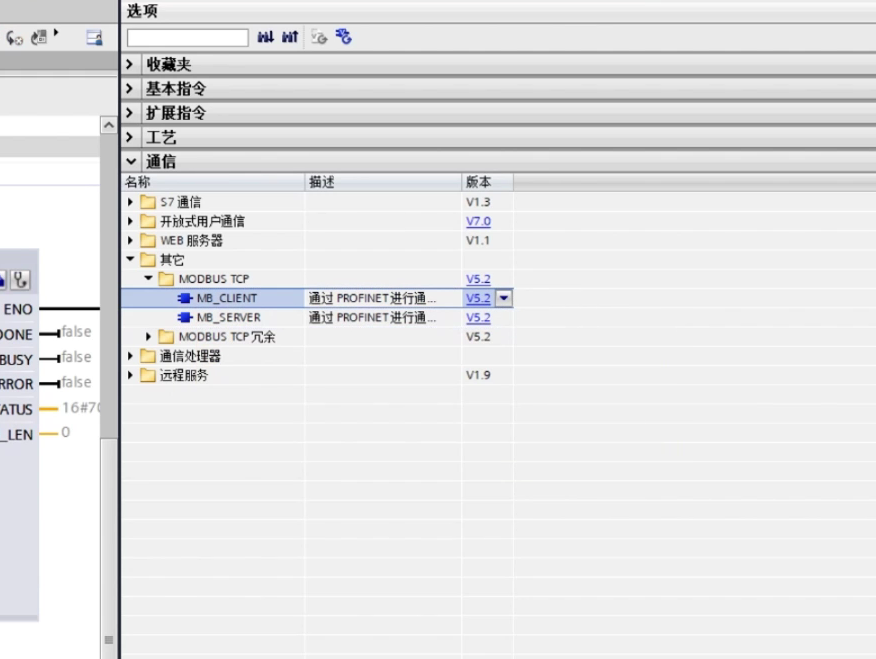

机器配置对照：

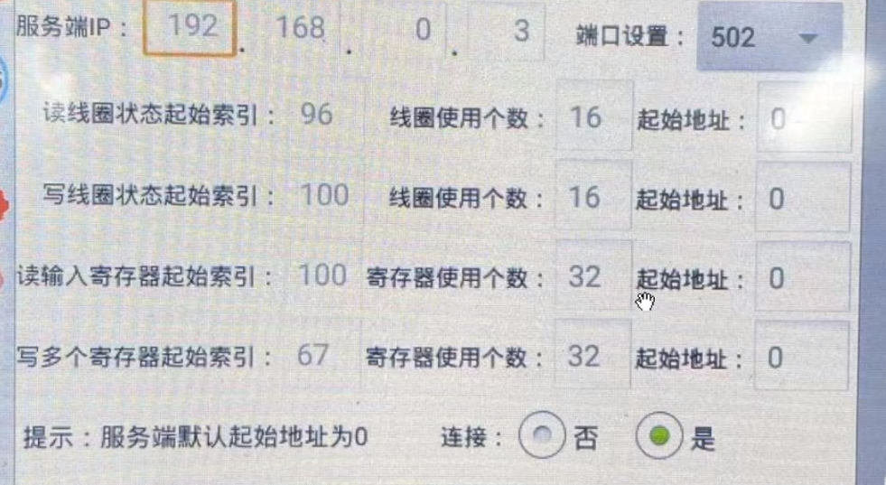

添加机器人数据块

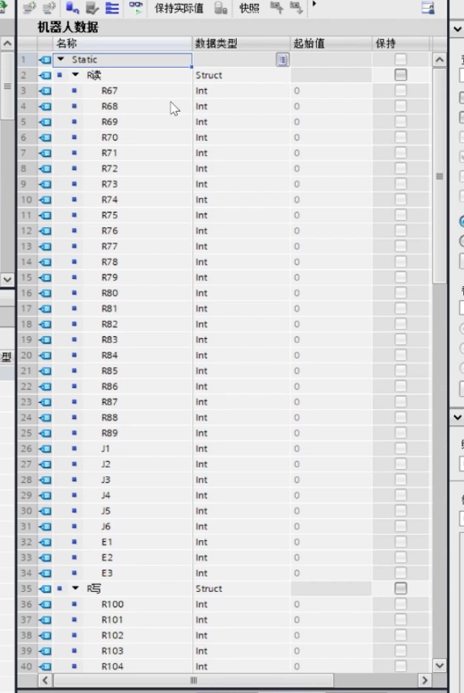

R写到131

注意，数据编写完成后，点击属性，选择优化块访问。

还需要个系统通讯对照块(存IP应该是在机器人数据里建即可)

ID为相机往后推，addr为机器人ip地址，端口为机器人端口502一般

添加到程序中：

控制发送过程可以建立三个数据块：

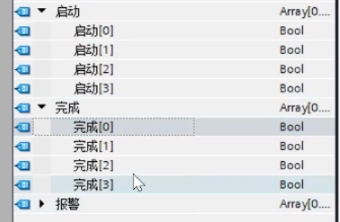

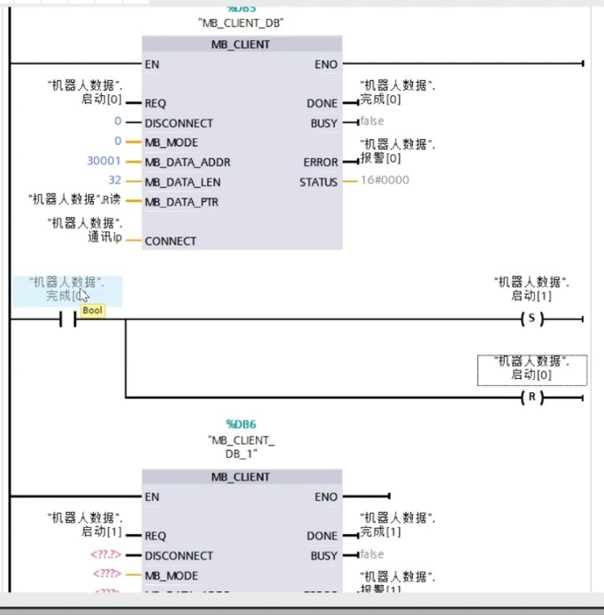

如何开机启动：

选择firstscan，然后把启动0置S

设置DI、DO，起始与数量由机器决定，编译

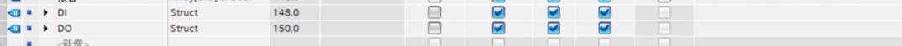

第三个：

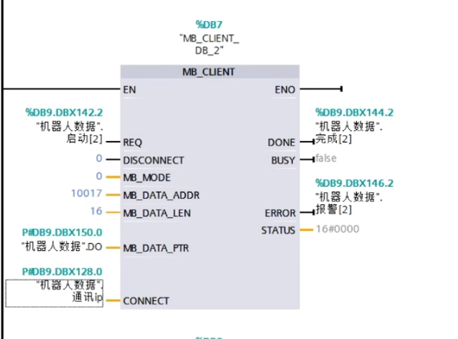
