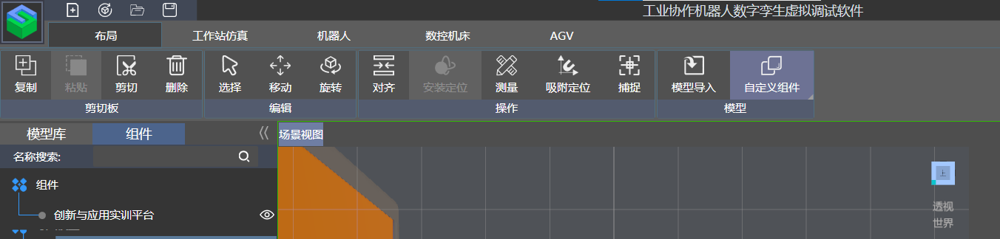
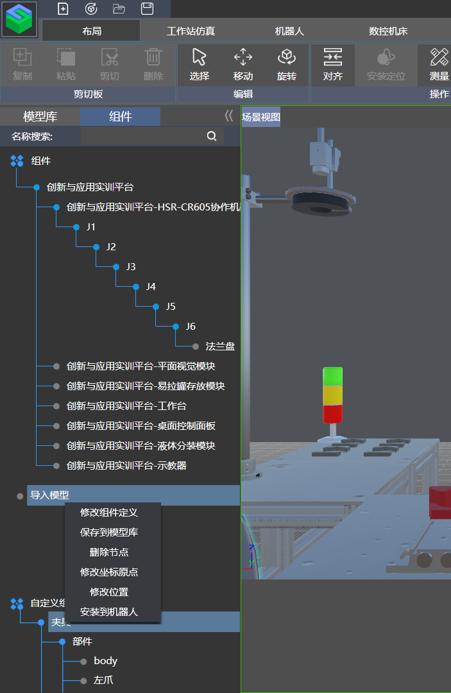
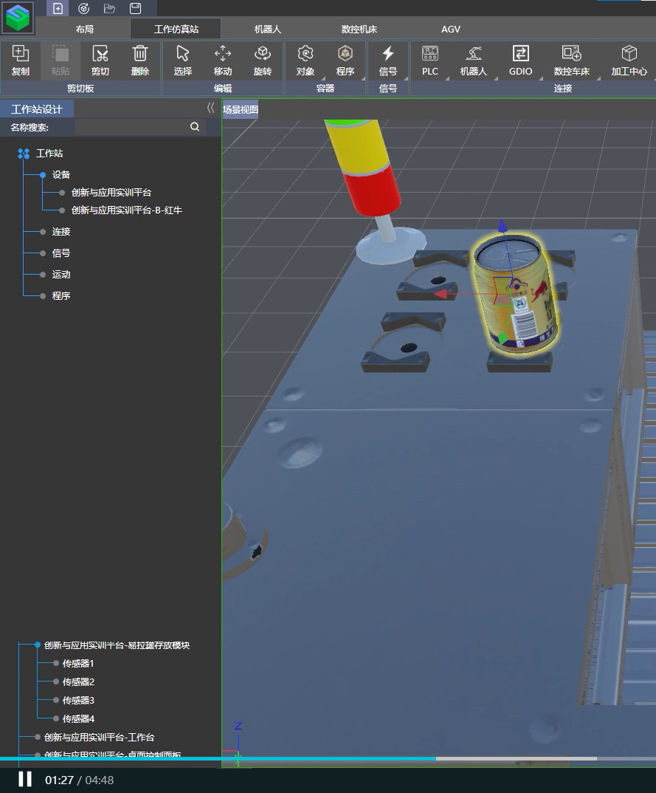
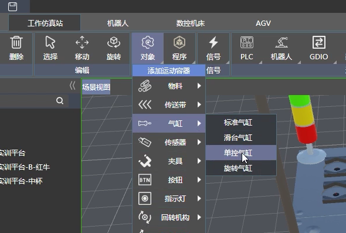
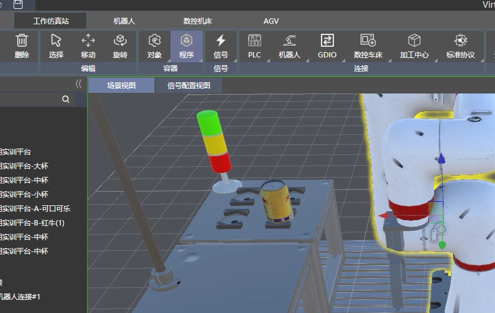
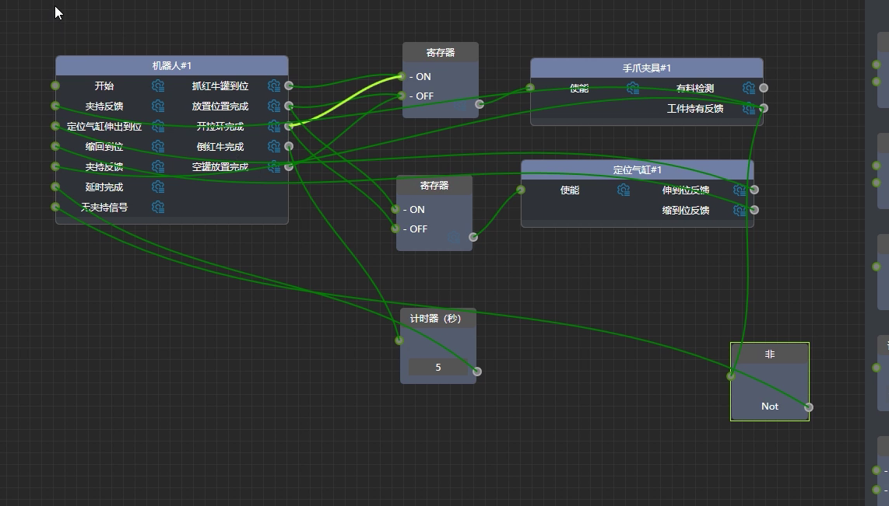
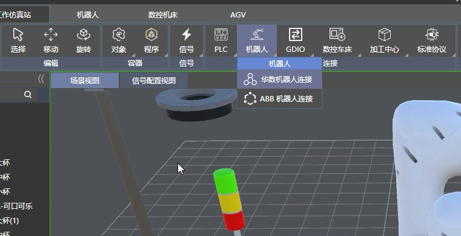
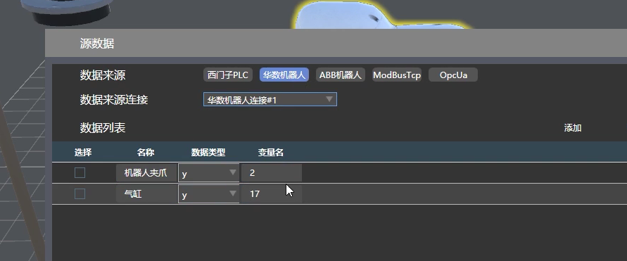
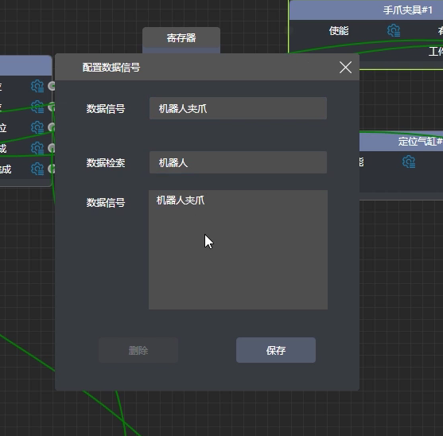

# 虚拟仿真保姆教程

#### 1.导入夹具、工作台。

1）在布局，模型库中找到工作台右键在场景中加载，放置。

2）在布局下，点击模型导入，导入夹具，注意路径最好不要有中文。

3）简单调整完成后，点击布局里的自定义组件。

4）定义静态动态部件，链接时点击包含对象然后点击组件中要链接的对象即可。

5）定义左右两个运动副

6）生成组件。

7）夹具有料检测位设置，使用捕捉，找到夹爪中心，复制，黏贴进有料检测设置里，大小为30即可。

8）发现坐标不在夹爪的中心，使用捕捉，找到夹爪重心，复制。

9）找到左边自定义组件栏，右键夹具，修改坐标原点，黏贴刚刚复制的东西进去。

10）装配夹爪。在工作仿真站中找到原有夹爪删除，

删除夹具板夹具

调整夹具到合适位置

在布局，组件中找到自定义的夹爪，右键安装到机器人，点击组件中写作机器人绑定。

#### 2.场景搭建与对象容器适配

1）导入红牛罐子，放置在正确位置。

tips：复制传感器位置，贴给易拉罐

水杯同上

2）配备容器

气缸

绑定气缸

夹具

绑定夹具

给使能方向错了的话，修改一下夹具定义即可

#### 3.机器人点位示教与程序录制。

1）在机器人，虚拟示教下点击记录位置，即可进行点位记录。

2）记录好点位之后，点击程序录制，即可进行点位的排序，以及运动模式的设定，L为直线运动，J为关节运动

3）程序事件与信号

点击工作仿真站的程序，事件分为信号与程序事件。

注：input与output是相对机器人程序来说的，如开始、夹持、气缸伸出到位信号是input给机器人程序，运动到位信号是机器人程序output出来。

4）信号配置

点击信号配置视图进行逻辑连线

配置板块，连线

5）开始仿真

工作站仿真中点击开始，可加上计分仿真。

点击程序中的机器人

给上开始使能即可开始仿真。

#### 4.虚实联调

1）工作站仿真中创建华数机器人连接

2）机器人中创建示教连接

绑定刚刚创建的华数机器人连接

3）点击工作仿真站中的华数机器人连接

设置类型、ip、端口

4）之后只考虑夹爪与气缸使能时刻

点击信号中源数据

在华数机器人中创建两个变量匹配实物变量

5）连接好之后配置信号

设置手抓使能

6）后续调整夹取、相机检测、倒饮料时，调整台面即可，饮料位置与实物应差不多，夹取信号接收可能会延时速度要放慢一点。
